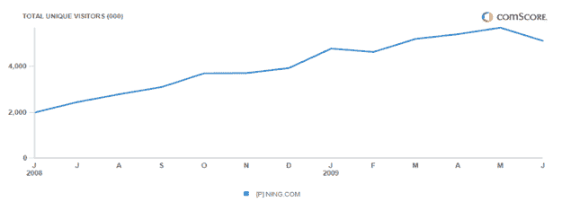

# 随着宁在美国的观众人数减少，它又筹集了 1500 万美元。

> 原文：<https://web.archive.org/web/https://techcrunch.com/2009/07/21/as-nings-us-audience-flattens-it-raises-another-15-million/>

# 随着宁在美国的观众人数减少，它又筹集了 1500 万美元。

自己动手的社交网络[宁](https://web.archive.org/web/20221207202503/http://www.ning.com/)向我们证实，该公司从光速投资伙伴那里又增加了[1500 万美元](https://web.archive.org/web/20221207202503/http://www.techmeme.com/090721/p98#a090721p98)。这使得筹集的资金总额达到[1.19 亿美元](https://web.archive.org/web/20221207202503/http://www.crunchbase.com/company/ning)。它的其他投资者包括艾伦公司、莱格·梅森、董事长兼联合创始人马克·安德森和雷德·霍夫曼。

宁与的千篇一律形成鲜明对比，允许任何人根据自己的特定兴趣或社会群体创建自己的社交网络。今年早些时候，宁通过[创建了 100 万个社交网络](https://web.archive.org/web/20221207202503/http://www.beta.techcrunch.com/2009/04/16/ning-1-million-social-networks-strong/)(现在已经达到 130 万)，但关键是这些社交网络中有多少是活跃的，吸引了多少人。根据 comScore 的数据，在美国，从 2009 年 5 月到 2009 年 6 月，独立访问者实际下降了 10%。今年 6 月，宁在美国的访问量达到 510 万人次(其全球访问量约为美国的三倍)。

该公司将这一下降归因于“6 月份的一些停机时间，因为我们扩展和优化了我们的基础设施，以支持我们预计在未来 12 个月内的增长。”宁表示，该公司每天新增 4000 个网络，每 15 天新增 100 万注册用户。

一个月的时间很难形成一种趋势，但宁在社交网络上的分散策略尚未像脸书的整体策略那样流行起来，无论是在网络上的活跃度还是纯受众范围。早在 2008 年 4 月，宁的估值为 5 亿美元，而现在据说已经达到 7.5 亿美元。这接近于 Bebo 能够卖出的膨胀水平，我们现在知道这个水平太高了。Bebo 仍然有更多的人使用它的产品。(即使在美国，6 月份也有 870 万独立访客)。

不过，宁已经开始行动了。早在 12 月，它就将成人电视网驱逐出了宁，因为它们对广告商不友好。这对他们来说效果很好。

最近，宁一直在努力使其社交网络与 OpenSocial 应用兼容。这一努力比预期的要慢得多。一位参与该项目的开发者表示，由于 Ning 应用平台的性能问题，上个月推迟了公开发布。

也许新的现金将有助于加快事情的进展。