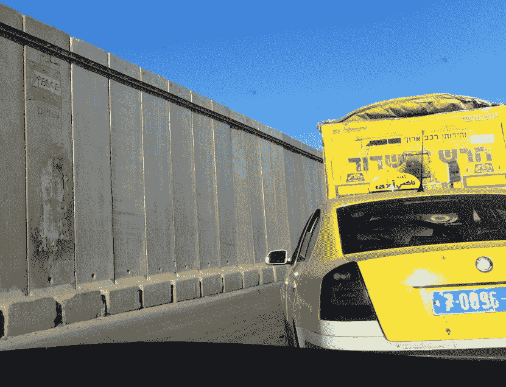
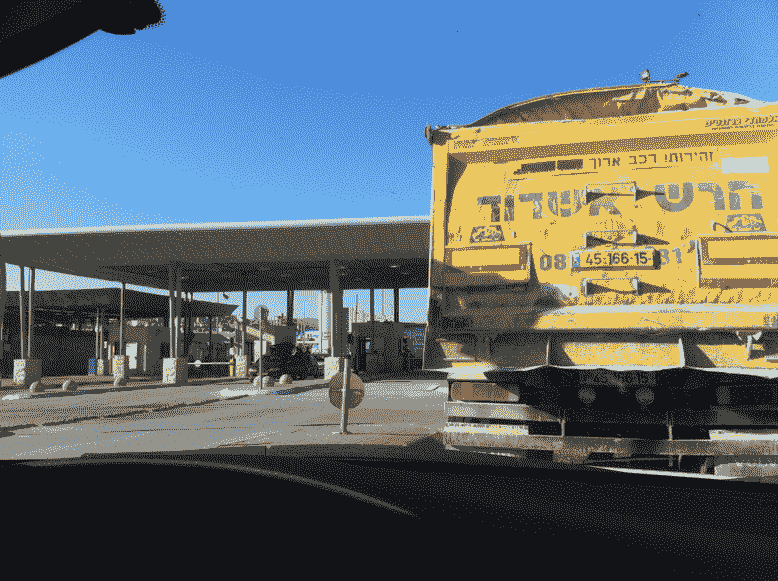
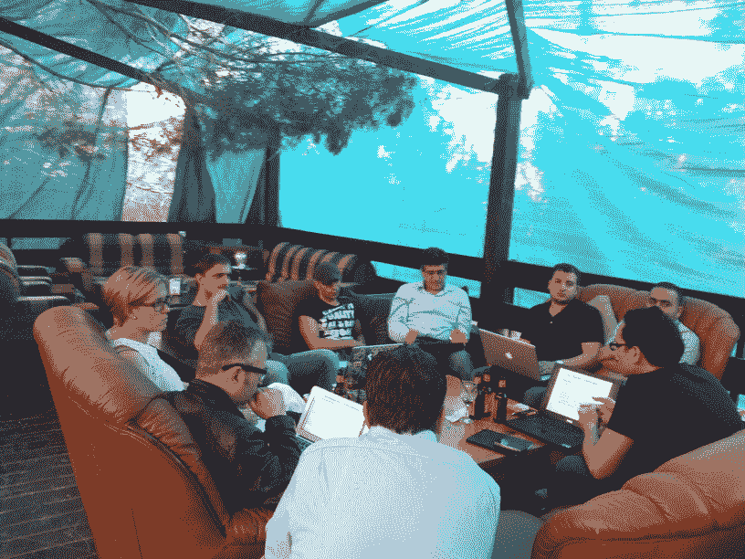
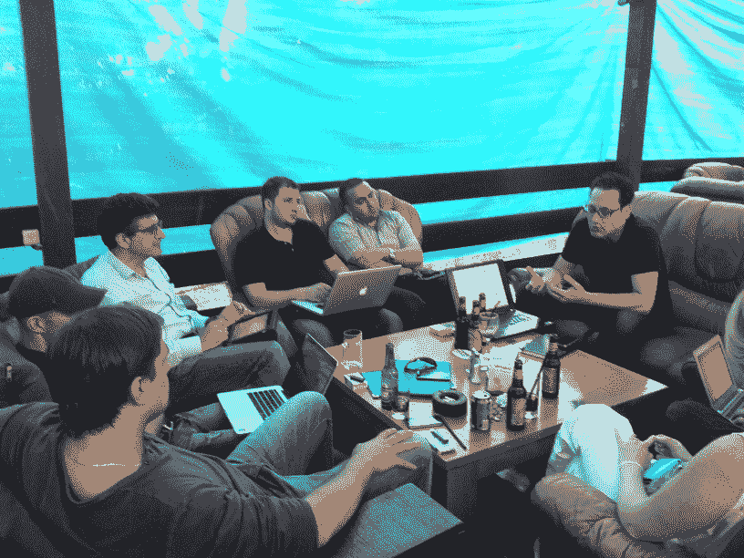
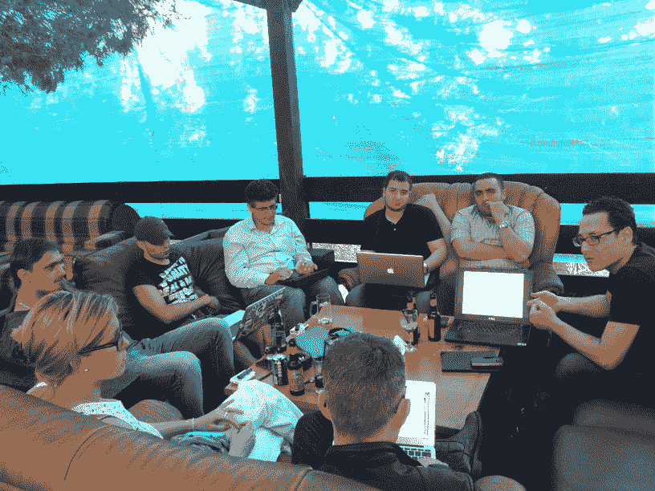

# 当奥巴马访问西岸时，巴勒斯坦人在为他们的科技创业未来而努力

> 原文：<https://web.archive.org/web/https://techcrunch.com/2013/03/24/as-obama-visits-the-west-bank-palestinians-reach-for-their-tech-startup-future/>

坐在 [Snobar](https://web.archive.org/web/20221207104210/http://al-snowbar.com/news) 里，乔治·哈德尔坐在,【Ramallah 最深处一个被冷杉树遮蔽的凉爽酒吧里，他说话的时候几乎是在拍桌子。作为一名在硅谷工作过的巴勒斯坦人，他热情洋溢地谈论着他对巴勒斯坦企业家掌控自己命运的渴望。“我从硅谷回来，因为我相信我能影响变革，”他告诉我。这种情绪在奥巴马总统访问以色列和西岸期间得到了呼应。本周，奥巴马特别谈到了旨在刺激巴勒斯坦科技生态系统和与大型、发达的以色列科技社区建立桥梁的项目。他说:“100 多家高科技公司在西岸找到了一个家，这体现了巴勒斯坦人民的才华和创业精神。”。

回到斯诺巴，你很容易把我和一群科技企业家的谈话误认为发生在欧洲某个时髦的地方——也许是施普雷河边的柏林“海滩”酒吧。但这不是世界上普通的聚会，也不是普通的企业家在讨论如何筹集风险投资或创办一家初创公司。

即使在以色列人和巴勒斯坦人之间持续不断的冲突造成的巨大政治和文化困难中——想想巨大的“和平墙”和严密的安全措施，这使得任何人，更不用说企业家，都很难走动——你仍然可以发现科技公司在销售他们的产品。

但我并不需要简单地从机场乘出租车去拜访这些企业家。几周前，我不得不与当地的一个非政府组织取得联系，这个组织可以让我进入西岸，安排我开车穿过以色列的武装检查站，花几个小时与初创公司会面，然后再离开。在这种环境下，你可以原谅一个巴勒斯坦科技企业家没有硅谷同行那么热情。

具有讽刺意味的是，安全局势的困难使技术成为巴勒斯坦人的理想产业。像网站和应用程序一样，在线“出口”不受与以色列安全相关的通常规则和条例的约束。

巴勒斯坦科技企业家的沮丧和不耐烦显而易见。尽管日常生活困难重重，他们还是迫不及待地想激活自己的科技生态系统。当这么少的人拥有智能手机并且没有 3G 网络可用时，你如何开发智能手机应用程序？巴勒斯坦人没有不受限制的宽带和 3G 连接，他们的以色列邻居只有很短的车程。如果你不能离开加沙地带，因为你和投资者的旅行都受到限制，你如何会见潜在的投资者？你如何组织一个简单的黑客马拉松？由于安全是以色列政府的主要关注点，移动电话塔受到高度限制，以防止它们被用作发射阵地。

利害攸关的是一个可以给巴勒斯坦人带来巨大经济利益的行业，更大的稳定，甚至可能积极改善与以色列的关系。

在这个世界的这个地方，创建一家科技创业公司并不需要像硅谷那样为创始人提供现金，赚取利润，然后开始下一次创业。一个繁荣的巴勒斯坦科技产业实际上可以改变整个经济落后的地区。技术最终可能意味着和平。

但巴勒斯坦企业家对本土产品型初创企业的增长速度感到沮丧。

我围着一张摆满咖啡和饮料的矮桌，与一个自称为 [Peeks](https://web.archive.org/web/20221207104210/https://www.facebook.com/groups/peeks.fb/) 的组织讨论技术趋势和在巴勒斯坦人中间发起技术革命的当地运动。代表“巴勒斯坦极客”，这个 2500 多名成员主要建立在[一个脸书集团](https://web.archive.org/web/20221207104210/https://www.facebook.com/groups/peeks.fb/)(在 Twitter 上: [@peeks_ps](https://web.archive.org/web/20221207104210/http://twitter.com/peeks_ps) )的基础上，但已经成为渴望效仿硅谷文化的新一代的载体。

与许多更成熟的贸易机构不同，Peeks 是任何 TechCrunch 读者都会知道的东西:企业家、初创公司和极客。

从 2010 年开始，Khadder 和他的 Peeks 创始人伙伴开始为居住在约旦河西岸和加沙地带的巴勒斯坦人创造可持续的企业家经济。

在 Peeks 社区中，成员们会发布事件和新闻，进行辩论并寻求帮助。这是一个由企业家组成的草根社区，他们相互支持，与学生、行业以及在世界各地从事技术工作的巴勒斯坦侨民进行互动。

他们意识到缺乏创业文化，没有“信任文化”，害怕失败。还缺乏研究，初创企业的私人文化与教育之间缺乏联系，教育系统中几乎没有私营部门的技能。因此，他们计划开发“基于可持续知识的资源”，并开展类似聚会和黑客马拉松这样的线下活动。

正如与太阳能创业公司[法雅能源](https://web.archive.org/web/20221207104210/http://www.yafaenergy.com/)合作的卡德尔所说:“我们需要的是一个将这些结合在一起的愿景。巴勒斯坦还没有这样的愿景。”

不管幻象存在与否，窥视似乎在推开一扇逐渐打开的门。加沙已经有了它的第一个孵化器，商业和技术孵化器(BTI)，西岸以产品为基础的创业公司开始出现(T4)。

巴勒斯坦企业家 Mohammad Kilany [共同创立了 Souktel](https://web.archive.org/web/20221207104210/http://www.synergos.org/bios/mohammedalkilany.htm) 一个“通过短信联系的 LinkedIn ”,它为雇员和雇主牵线搭桥。ArtTech 是一家制作应用程序的工作室，比如 Android 平台上的 X-Bugs 游戏。

乔治·哈拉比创建了一个分类网站 SafqaOnline，试图成为巴勒斯坦人的 CraigsList。FinJANi 是一个类似 iGoogle 的起始页。Steadypoint 是一家总部位于拉姆安拉的公司，致力于开发 RFQ 平台。Idevator 是一家类似 Zynga 的初创公司，为中东地区制作游戏。Yousef Ghandour 是 Anabasalli(T20)的创始人，这是一款帮助穆斯林祈祷的安卓应用。

创业公司的名单各不相同，但 Peeks group 的成立反映了技术社区中许多巴勒斯坦人越来越渴望摆脱传统的 It 外包行业，这一行业经常得到捐助者和外部非政府组织的补贴。

事实上，甚至一些以色列科技公司也使用了拉马拉的工程师。有时他们走得更远——g . ho . ST 初创公司(现已倒闭)是由出生于英国的以色列首席执行官 Zvi Schreiber】创办的，他与巴勒斯坦商人 Tareq Maayah 一起为这家初创公司在拉马拉开设了一个办事处，与以色列的摩丁办事处平行。

也就是说，纯粹的 IT 外包对巴勒斯坦人来说是一个成功的行业。

根据思科去年 7 月委托撰写的白皮书，从 2008 年到 2010 年，巴勒斯坦 IT 部门增长了 5 倍多，现在占巴勒斯坦国内生产总值的 5%以上。该报还指出，欧洲投资银行在过去三年中向巴勒斯坦高科技领域投入了 7800 万美元，思科公司自 2008 年以来向约旦河西岸投入了 1500 万美元。

其他非正式估计认为，巴勒斯坦的 ICT 产业规模为 3 . 5 亿美元，其中约 1 . 5 亿美元用于电信行业，另外 2000 万美元用于软件开发。其中大部分被认为是在外包公司。

思科、谷歌和美国国际开发署等公司也有大量的外部兴趣和投资。所有人都在新兴的巴勒斯坦技术领域展示了自己的资源。跨国公司显然信任巴勒斯坦公司来完成这项工作。这一点很重要。

但是 Peeks 和其他像他们一样的巴勒斯坦企业家是如此渴望促进和培养基于产品的创业公司，而不是外包。

据估计，只有大约 5-10%的技术市场被认为是“可出口的”——这是本土创业公司制造可用于国际的产品的代名词。根据卡德尔的说法，“动力将从这里产生。”

“巴勒斯坦要发展，就必须发展基于知识产权的技术，而不仅仅是外包，”他表示。Peeks group 敏锐地意识到，正如一位 Peeks 成员对我说的那样，继续依赖外包工作是“最糟糕的事情”。"

具有讽刺意味的是，巴勒斯坦企业家意识到——正如以色列多年前所做的那样——他们将不得不创建初创公司和自己的知识产权。因为不需要天才也能看出这个地区的每个人都在同一条船上。自然资源匮乏，政治不稳定，产品“出口”很困难。

Peeks 的可持续发展意味着不必依赖施舍，并建立长期的，可行的技术产品，这些产品是由他们自己的人创造的，而不是为世界上另一个地方的其他人工作。

Khadder(见下图)认为创业精神是关键:“(巴勒斯坦)政府、私营部门和学术界在创业精神方面表现不佳。我们需要有远见卓识的人来推动创业精神。”

你可以从他使用的语言中看出他对这个主题的热情:“无论是在代码、规模还是成本方面，我们都不是该死的印度。我们需要在知识产权和创新方面创造自己的利基市场。我不管它是什么——游戏，社交媒体，任何东西——问题是这是我们在巴勒斯坦建立一个可持续发展的技术部门的唯一途径，”他说。

问题的一部分是像 T2 的巴勒斯坦信息技术协会(PITA)这样的商业组织倾向于给老牌 IT 公司而不是初创公司发言权。一个联合组织，巴勒斯坦 ICT 孵化器(PICTI)，尽管已经有了 7 年的记录，却没有取得太大的成功。

“关键绩效指标一直是‘让我们花掉援助资金’，而不是‘让我们创造一个价值主张’，”Khadder 说。这是援助资金和巴勒斯坦人自己的错，他们接受了这些议程，没有挑战它们。焦点是外包、外包和更多的外包——没有赋予科技企业家权力。这就是我们试图用 Peeks 来改变的，至少从草根的角度来看是这样的。"

PITA 的业务发展主管 Mohammed Musleh 表示，情况要复杂得多:“Peeks 的设计来自社区，但 PITA 关注的是成长中的公司。我们把自己视为第二阶段，因为公司从 Peeks 这样的组织中脱颖而出。我们认为我们的关系是共生的。我们不能相互对立，我们需要共同努力来确保社区的发展。当他们需要辩护、法律建议和更多核心内容时，皮塔可以为他们提供帮助。”

但是缺乏“聪明”的投资者、高度管制的经济、老式的银行系统、陈旧的公司法(大部分是从约旦继承的)都于事无补。例如，巴勒斯坦没有不同类别的股票或可转换贷款的结构。

当你问 Peeks 成员关于非政府组织的活动时，他们会翻白眼。

私下里，这些科技企业家无法抑制他们对援助资金和非政府组织在巴勒斯坦科技领域的努力被“非常糟糕”地花掉的深深失望。正如一个人所说，这些钱花在了“引人注目的事件”上，几乎没有实现长期价值。那些钱都是短命的，“关键绩效指标没有超过一年。”

但是并不是所有的非政府组织都受到批评。美慈组织是当地巴勒斯坦初创企业特别称赞的一个。

自 2008 年以来，该非政府组织一直与西岸/加沙的巴勒斯坦信息和通信技术部门合作，与大学、TVET 机构和其他机构合作，试图让学生适应所谓的“市场驱动科目”和更软的技能，如在该地区更难获得的营销。在过去的两年里，它在纳布卢斯和加沙赞助了四次创业周末，将巴勒斯坦的技术人员聚集在一个更加随意的环境中。他们还帮助支持以色列境内的阿拉伯人在拿撒勒组织的 SUW。这个非政府组织得到了欧盟、希望之源基金会、谷歌基金会和美国国际开发署等机构的支持。

美慈组织的项目经理托瓦·谢尔说:“在过去的四年半时间里，我一直与巴勒斯坦的科技社区合作，看到巴勒斯坦发生的变化令人兴奋。当我刚开始工作时，环境非常以公司为中心。来自不同公司的人在工作之外很少见面，也不分享他们在做什么样的项目。现在，部分通过我们在美慈、Peeks 和其他公司的努力，年轻的开发人员看到了分享和互相帮助的价值。”

她说，最近的融资故事鼓舞了巴勒斯坦企业家，“在国外的巴勒斯坦人正在考虑回家。”

然而，她对技术可以治愈所有疾病的观点提出了警告:“对巴勒斯坦的技术及其支持巴勒斯坦经济的潜力有很多炒作。我们现在正在进行一次重大的现实检查，需要更加现实地看待什么是可能的，什么是不可能的。虽然有很大的潜力，但巴勒斯坦的计算机科学毕业生在大学毕业时并不具备创办自己的公司或成为优秀员工所需的技能，他们只是刚刚毕业。虽然创业公司创造了新的工作和机会，但我认为创业公司并不适合所有人，人们也需要在老牌公司工作。”

“在最好的条件下，建立一个新的创业生态系统通常需要 6-8 年的时间。在加沙和约旦河西岸，巴勒斯坦人面临着与博尔德或硅谷不同的现实。她说:“不能完全忽视巴勒斯坦人面临的政治现实、行动和访问限制，即使云使虚拟商品的出口变得更容易……但巴勒斯坦极客社区的基层努力，结合当地的努力，将巴勒斯坦侨民和感兴趣的支持者联系起来寻求帮助，正在将巴勒斯坦带到一个新的水平。”

事实上，尽管有所有明显的缺点和障碍，我没有听到多少抱怨。他们的想法更多的是试图支持和促进一种新的企业家精神和接受失败的文化。事实上，正是这种文化帮助以色列成为了一个“创业国家”,也帮助了巴勒斯坦。

为了实现这一目标，Peeks 已经“开始鼓励合作，培养企业家，建立与大学的联系。Khadder 说:“我们试图重新发现志愿精神。

他承认，巴勒斯坦商业的某些方面过于依赖外部援助和他所谓的“施舍”——当他说话时，你会意识到他的话就像许多企业家说的那样:他们不想要特殊照顾。总的来说，他们希望对创业的限制，无论是法律上的还是政治上的，都不要碍事。

到目前为止，Peeks 已经成功超越了他们的体重。比如邀请微软前副总裁瓦利德·阿布·哈德巴(Walid Abu-Hadba)访问巴勒斯坦，他是在任高管中级别最高的一位，尽管他是以个人身份而非官方身份访问的。其他到访过的还有涨潮资本董事长 Ossama Hassanein 保罗富勒顿，高级经理，思科，等等。

此外，还有其他迹象表明，当地生态系统正在发展壮大，而最重要的是，投资者也在发展壮大。

Sadara Ventures 是一家新成立的风险投资公司，旨在帮助巴勒斯坦科技初创公司，由巴勒斯坦人 Saed Nashef 和以色列人 Yadin Kaufmann 创立。考夫曼在 1990 年创立了 Veritas Venture Partners，并资助了 2000 年上市的视频会议公司 Accord Networks 和 1995 年被 AOL 收购的即时通讯先驱 Ubique。Sadara 计划专门投资于巴勒斯坦的科技初创企业，并计划在 10 年内入股约 15 家公司。

它已经向 Souktel(如上所述)和酒店预订平台 [Yamsafer](https://web.archive.org/web/20221207104210/http://www.yamsafer.me/en/home) 投入了 100 万美元。

Sadara 已经筹集了大约 2950 万美元，是唯一一家投资巴勒斯坦科技公司的风险投资公司。有迹象表明投资范围更广:迪拜的 Rasmala 投资银行正在投资资本市场，而 6，000 万美元的私募股权支持的 Siraj 巴勒斯坦基金和 Abraaj Capital 的 3，600 万美元的巴勒斯坦增长资本基金是专注于巴勒斯坦中小企业增长阶段投资的私募股权基金。

其他新举措也加入了 Sadara。 [FastForward](https://web.archive.org/web/20221207104210/http://www.fastforward.ps/) 是拉姆安拉一个全新的加速器，模仿创业周末“SWNext”五周计划。

Sadara 的 Nashef 说，他和 Yadin“开始筹集我们的基金，因为我们都相信在巴勒斯坦有机会进行有利可图的投资，同时创造社会影响。真正的大事是建立第一只风险投资基金，投资巴勒斯坦的初创科技公司，并得到 EIB、思科、索罗斯(SEDF)和斯科尔等顶级投资者的支持。”

尽管他表示，这个生态系统“仍处于初级阶段，而且“在我们成为一个成熟的科技生态系统之前，还有很多工作要做”，但他预计每年将在巴勒斯坦投资两家基于产品的初创公司。

尽管他承认，许多短期机会只是在西方获得成功的初创公司在当地的翻版，但他希望它们将开始看到深度的技术创新，尽管“这可能需要几年时间。你必须明白，萨达拉在这里所做的是有效地启动一个生态系统。我们将长期参与其中，对此我很乐观。”

他说像 Peeks 这样的组织是“一个好的开始，但还不够。我希望在我可以舒舒服服地说巴勒斯坦的企业家正在掌握自己的命运之前，能够看到大量的创业活动在实地定期开展。我们仍然需要实际创始人在社区中发挥更大的领导作用。”

他还认为“外包将伴随我们一段时间，这不一定是件坏事。它建立了能力，并创造了一个集群，可以支持基于知识产权的创业。我相信，在本地行业格局发生重大变化之前，我们需要有第一个成功退出的故事。”

在目前的早期阶段，还无法判断巴勒斯坦草根科技活动的兴起会对以色列方面产生什么样的影响。然而，这种以企业家为主导的方式或许有希望在双边关系中带来回报。

一两个以色列投资者甚至给出了一些有希望的迹象。高调的纽约天使投资人杰夫·普尔弗——他广泛投资于以色列的初创企业——最近告诉科技杂志 Informilo，他将在 2013 年“寻找以色列/阿拉伯领导的初创企业”。他最近参加了在拿撒勒举行的首届黑客马拉松，参加的有居住在以色列的阿拉伯人和巴勒斯坦人，他还在拉马拉会见了企业家。像麻省理工学院项目[中东科技教育](https://web.archive.org/web/20221207104210/http://meet.mit.edu/)这样的项目，将年轻的以色列人和巴勒斯坦人聚集在一起学习科技和商业技能。

即使在以色列技术机构的最高层，也有迹象表明，在快速发展的以色列技术世界和巴勒斯坦方面之间，有一天可能会出现解冻。就连 1998 年以 4 . 07 亿美元离开 ICQ 加盟 AOL、如今在以色列政坛拥有教父般地位的 Yossi Vardi，[在去年的 Dublin Web Summit](https://web.archive.org/web/20221207104210/http://new.livestream.com/websummit/DWS12Main/videos/5872006)舞台上也表示，他希望以色列和巴勒斯坦的技术人员在未来能有更多的合作和交流。

但纳舍夫并没有看到更多的阿拉伯/以色列合作技术:“鉴于目前的紧张局势，这种技术很少见，也不太受欢迎。很多事情都取决于政治方面的进展，在那之前，这将继续是一个非常敏感的问题。”

困难就在这里。人们无法逃避当地的政治。巴勒斯坦的创业精神在当地仍然存在明显的实际障碍。在整个西岸和加沙地带，失业率很高，流动性受到限制。对流动的限制意味着，通常一开始从国外招聘的高级管理人才是一个非常大的挑战。

但是，就像硅谷以外世界上任何地方的企业家一样，一些最大的障碍仍然存在于人们的头脑中。与生活在以色列的巴勒斯坦人和阿拉伯人交谈，你会发现他们坦率地承认，古老的规避风险的商业文化仍然是创业公司发展的最大障碍之一。然而，当日常生活如此充满风险且难以预测时，这或许是可以理解的。

当然，这里有一个巨大的讽刺。

以色列在 20 世纪 80 年代、90 年代和 21 世纪初赖以摆脱经济孤立的技术产业，也是许多巴勒斯坦企业家希望摆脱类似困境的产业。

这是如此具有讽刺意味的一件事，以至于我在拉马拉的 Snobar 遇到的一个小型聚会也没有忘记这一点。

“就技术而言，巴勒斯坦相当于 20 年前的以色列，”卡德尔承认道。但无论需要多长时间，他、Peeks 和其他人都计划开启巴勒斯坦科技创业公司的新时代。