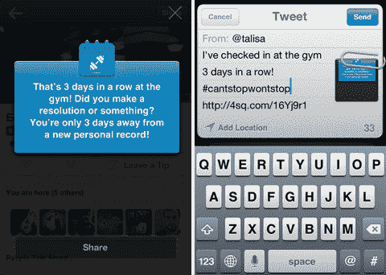

# 随着用户厌倦了市长竞选，Foursquare 找到了一种鼓励签到的新方法:利用量化的自我评价 TechCrunch

> 原文：<https://web.archive.org/web/https://techcrunch.com/2013/05/09/as-users-tire-of-mayorship-wars-foursquare-finds-a-new-way-to-encourage-check-ins-by-tapping-into-quantified-self-buzz/>

# 随着用户厌倦了市长竞选，Foursquare 找到了一种鼓励签到的新方法:利用量化的自我评价

虽然 Foursquare 现在正忙着与 Yelp 竞争，Yelp 是一个更有回报但更个人化的用例(现在围绕徽章和市长职位的热情已经消退)，但它有能力在你签到时增加洞察力和数据。通常在注册你的位置后，应用程序会通过弹出消息奖励你一些鼓励或评论。今天，这项服务通过一个新的按钮让这些小时刻变得可以分享，这个按钮可以让你编辑并发布信息到脸书、推特等等。

例如，你可能知道你从去年 12 月起就没有去过某个机场，或者这是你连续第三天去你最喜欢的地方。在 Foursquare 的[博客文章](https://web.archive.org/web/20221207013345/http://blog.foursquare.com/2013/05/09/just-hit-100-weeks-in-the-row-at-the-gym-now-you-can-easily-share-your-best-moments/)中，它给出了一个用户想要吹嘘连续三天去健身房的例子。(尽管让我们现实一点，我们可能会看到更多的人张贴他们正在进行的酒吧条纹，你不这样认为吗？)

表面上看，这一更新似乎是一个小问题，但它可能会鼓励更多 Foursquare 用户更经常地返回应用程序，以便发布和分享，而不是试图赢得市长桂冠或其他一些厌倦的奖品，如徽章。这些事情起初很有趣，但兴奋感已经消失了。但 Foursquare 仍然需要稳定的数据流来保持其本地推荐的及时性和准确性。

该功能还与“量化自我”设备的新运动紧密结合——例如，用户正在尝试 FitBit 或 Jawbone UP 等产品，以便通过数据跟踪和了解他们的日常活动。

事实上，Foursquare 创始人丹尼斯·克劳利(Dennis Crowley)上周在 Disrupt NY 接受 TechCrunch 采访时表达了对量化自我空间的兴趣。尽管他否认了有关 Foursquare 开发自己的可穿戴设备的传言，但他确实表示，这是 Foursquare 希望进一步探索的领域。

同样值得注意的是，[克劳利最近在跑波士顿马拉松时使用了一个自动登记工具](https://web.archive.org/web/20221207013345/https://twitter.com/dens/statuses/323869879272865792),这让他可以一英里一英里地追踪自己的进度——所以他显然是一个粉丝。

Foursquare 实际上通过其历史记录坐拥个人数据的金矿，但在此之前，利用这些信息的消息一直是短暂的——你会看到它们，然后点击关闭，仅此而已。今天的更新是让用户更好地与 Foursquare 的数据存储互动的第一步，即使只是通过将它发布到社交网络或将图像保存到他们的相机胶卷中。

这项新功能适用于 [iPhone](https://web.archive.org/web/20221207013345/https://itunes.apple.com/us/app/foursquare/id306934924?mt=8) 和 [Android](https://web.archive.org/web/20221207013345/https://play.google.com/store/apps/details?id=com.joelapenna.foursquared&hl=en) 。