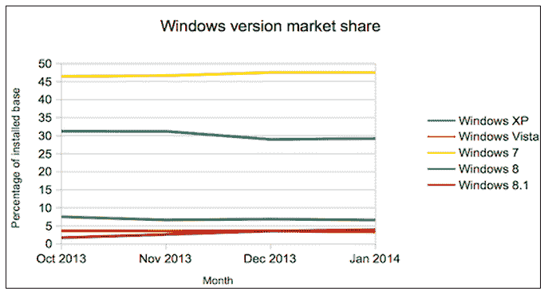
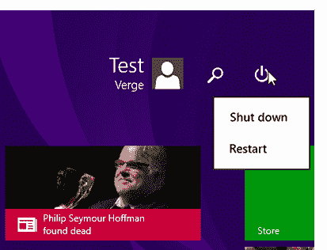

# 随着 Windows 8.1 超过 Vista 的市场份额，Update 1 泄露在线 

> 原文：<https://web.archive.org/web/https://techcrunch.com/2014/02/03/as-windows-8-1-overtakes-vistas-market-share-update-1-leaks-online/>

# 随着 Windows 8.1 超过 Vista 的市场份额，Update 1 在网上泄露

一月份， [Windows 8.1 超过了 Vista 的市场份额](https://web.archive.org/web/20221005161353/http://www.theregister.co.uk/2014/02/03/windows_81_becomes_worlds_fourthmostpopular_desktop_os/)，在 7、XP 和 8 之后位居第四。本月，Windows 8.1 的市场份额有所上升，Windows 8 如预期的那样有所放缓，这意味着微软的新平台总体增长缓慢。

事实上，Windows 8 . x——Windows 8 和 Windows 8.1——在本季度仅获得 0.09%的市场份额。

从更广泛的角度来看，Windows 7 基本持平，Windows XP 下降了 0.5%以上。Vista 继续变得无关紧要。收银台那边的[好伙计们很友好地用图表显示了这些数据:](https://web.archive.org/web/20221005161353/http://www.theregister.co.uk/2014/02/03/windows_81_becomes_worlds_fourthmostpopular_desktop_os/)

值得注意的是，Windows XP 作为一个操作系统的衰落是缓慢的，远远慢于在 4 月 8 日[官方支持结束时让世界完全脱离代码所需的速度。Windows XP 今年将迎来 13 岁生日。微软希望它消失。然而，部署了 it 的公司似乎更愿意保持现状，而不是升级。](https://web.archive.org/web/20221005161353/http://www.microsoft.com/en-us/windows/enterprise/endofsupport.aspx)

## 更新 1

该公司计划的 Windows 8.1 更新 1 于本周末泄露，展示了微软的想法:对其当前的桌面和平板电脑平台进行修复、改进和一般生活质量更新。正如您对一个未编号版本的期望，变化是适度的。

更新 1 预计在 4 月份发布，但最近的传闻表明新代码最早可能在 3 月 11 日登陆。此外，泄露的内容很可能不是当前的版本，也不是该公司打算发送给消费者的内容。

先不说警告，在更新 1 中我们能看到什么？正如预期的那样，新代码包括用户界面的变化，使使用键盘和鼠标操作系统变得更容易。The Verge [贴出了泄露版本](https://web.archive.org/web/20221005161353/http://www.theverge.com/2014/2/2/5372662/windows-8-1-update-1-leaks-ahead-of-release)——[的截图，展示了新功能:](https://web.archive.org/web/20221005161353/http://www.theverge.com/2014/2/2/5372672/windows-8-1-update-1-screenshots)

另一个有趣的，也是预期的变化，是微软开始将 Metro 应用程序带到桌面上。更新 1 中还包括了将地铁应用钉在任务栏上的功能。因此，你可以从桌面环境中选择 Metro 应用，更好地模糊了 Windows 8.x 中传统和新应用之间的二分法

根据 Paul Thurrott 的说法，默认情况下，Windows Store 应用程序会自动固定在任务栏上。你也可以选择让所有的 Metro 应用程序都打开。微软正在削弱 Windows 8.x 的地铁方面，但通过将商店带到桌面的前端和中心，它可以缓解其新平台和市场的潜在势头损失。

你可以用一句简单的话来追溯 Windows 8.x 的发展轨迹:微软在 Windows 8.0 中引入了如此多的新功能，以至于挤出了桌面体验。然而，用户仍然更喜欢 Windows 的桌面部分，留下了近乎强迫的主要体验。8.1 切断了地铁和桌面之间的鸿沟，似乎更新 1 将继续这一努力。

微软拒绝对泄露的版本发表评论。

*顶级图片致谢:[Flickr](https://web.archive.org/web/20221005161353/http://www.flickr.com/photos/dekuwa/)*