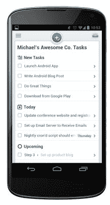

# Asana 为 Android  带来了简单的任务管理和生产力应用程序

> 原文：<https://web.archive.org/web/https://techcrunch.com/2013/02/28/asana-brings-simple-task-management-and-productivity-app-to-android/>

# Asana 为 Android 带来了简单的任务管理和生产力应用程序

备受瞩目的生产力初创公司 Asana 试图围绕任务(而非电子邮件)重新设计工作场所，该公司推出 iOS 应用已有五个月，但尚未推出 Android 应用，尽管其一半用户都在该平台上。今天，Asana 终于推出了一款原生 Android 应用。

我们被告知，Android 应用程序是用户要求最多的功能，与 iOS 应用程序有很多相同的功能。事实上，该应用程序本身在 UX 和设计方面与 iOS 应用程序相似。正如联合创始人贾斯汀·罗森斯坦(Justin Rosenstein)解释的那样，花时间专注于 iOS 和单一平台使该公司能够找出最适合用户体验和应用设计的方式。

该应用程序本身允许您在旅途中创建、分配和编辑任务。您还可以添加截止日期、注释、标签和关注者，对任务进行评论，设置重复任务以及搜索您的工作区。

【T2

罗森斯坦说，关键的附加功能之一是全功能搜索，允许你搜索公司在应用程序中跟踪的所有内容，而不仅仅是你创建或标记的任务。

迄今为止，Asana 已经见证了数万个团队创造的 4000 万个任务。正如罗森斯坦向我们解释的那样，Asana 已经成为“如何在内部完成工作的核心支柱”，不仅对科技初创公司如此，甚至对非营利组织和企业也是如此。

