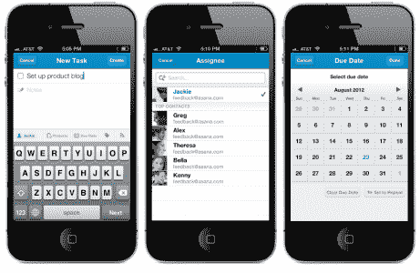

# Asana 为重新设计的 iOS 应用程序| TechCrunch 带来了轻量级的核心任务管理

> 原文：<https://web.archive.org/web/https://techcrunch.com/2012/09/06/asana-brings-smooth-task-management-to-new-version-of-ios-app/>

# Asana 为重新设计的 iOS 应用程序带来了轻量级的核心任务管理

试图围绕任务(而不是电子邮件)重新设计工作场所的高调生产力初创公司 Asana,[发布了新的 iOS 应用](https://web.archive.org/web/20230406162026/http://itunes.apple.com/us/app/asana-mobile/id489969512?mt=8)。值得仔细看看，即使你真的很爱电子邮件。今天最大的改进是一个原生的任务创建和编辑界面，它包括了你在 web 版本中可以找到的功能:添加截止日期、重复任务、添加任务关注者和标签，以及创建和编辑笔记。

之前的[大移动更新](https://web.archive.org/web/20230406162026/https://techcrunch.com/2011/12/27/appsana/)，从 2011 年底开始，看起来不错但是没让你做多少。它有一个多窗格设计，你可以左右滑动来浏览。这个全新的版本将导航移到了顶部菜单栏，从用户体验的角度来看，这是有意义的。如果 Asana 对最近推出的一系列非常简单的移动优先任务应用感到威胁，这个新版本也是一个很好的反驳。

在从昨晚开始的测试中(我们使用 Asana 来管理我们的周末发布时间表)，我很好地利用了新增的功能，我可以感觉到速度也随之提高。但是我发现了一个有点烦人的缺点。当你加载应用程序时，它默认为你的家庭工作区，而不是你最常用的工作区。由于我首先创建了个人工作区，这意味着我总是点击它，而不是我的 TechCrunch 视图。每当我想进入我的工作帐户时，我都必须通过顶级导航进行回溯。[ **更新**:正如我以前的 VentureBeat 同事和现在的 Asana guy [Dan Kaplan](https://web.archive.org/web/20230406162026/https://twitter.com/dankaplan) 在评论中指出的，你可以通过将你想要默认的工作区拖放到 web 应用程序左侧菜单的顶部来解决这个问题。]

该应用还缺少几个月前添加到网页版的[收件箱任务活动提要功能](https://web.archive.org/web/20230406162026/https://techcrunch.com/2012/06/27/with-new-inbox-feature-asana-is-looking-more-like-that-email-slayer-were-all-longing-for/)。但是在今天的一篇博客文章中，公司[称](https://web.archive.org/web/20230406162026/http://blog.asana.com/2012/09/our-iphone-app-levels-up/)即将到来。

如今，有很多初创公司试图为工作场所提供更好的生产力工具，但 Asana 一直坚持其更大的愿景，即取消电子邮件，将工作重点放在个人必须做的具体事情上。整个产品和这个应用程序可能不适合所有人，但它值得一试，因为它的整体易用性和更大的视野。由早期的脸书员工/联合创始人创办，现在银行里有一大笔 2800 万美元的资金，Asana 肯定会在未来很长一段时间内存在(并将有所改进)。

注意:我会用我自己账户的截图，但是你们会看到我们这个周末的计划。