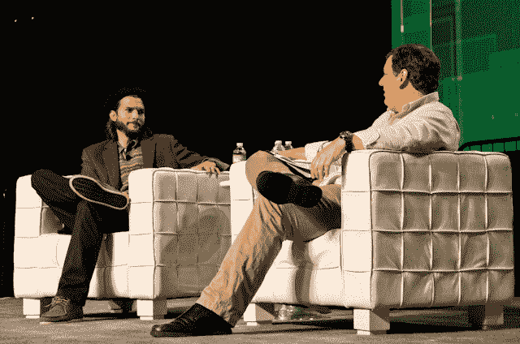

# 阿什顿·库彻:好的投资者正在进行政治迫害

> 原文：<https://web.archive.org/web/http://techcrunch.com/2011/09/13/ashton-kutcher-good-investors-are-on-a-witch-hunt/>

# 阿什顿·库彻:优秀的投资者正在进行政治迫害

科技投资者

[Ashton Kutcher](https://web.archive.org/web/20230329032003/http://www.crunchbase.com/person/ashton-kutcher)

今天站在 TechCrunch Disrupt 的舞台上与

[Michael Arrington](https://web.archive.org/web/20230329032003/http://www.crunchbase.com/person/michael-arrington)

谈论他在技术社区的投资和参与。有趣的是，库彻的艺术实际上是在模仿他的生活，他将在 CBS 的《好汉两个半》中扮演科技投资者沃尔登·施密特——施密特和库彻一样，也是一名科技投资者，一名互联网企业家，他将自己的公司卖给了微软，现在投资于科技初创公司。

当被迈克尔·阿灵顿问到“你为什么投资？”库彻谈到了对技术发展方向的看法，他问道:“如果一个朝圣者看到一台运行中的计算机，会发生什么？”他说，他们会认为这是一种黑魔法，他把投资者比作寻找这种魔法的人，“我们正在进行一场政治迫害，寻找一种神奇到你无法理解它是如何运作的东西，”他说。

库彻说，他个人的好奇心和对技术的兴趣基本上源于对魔术是如何工作的兴趣，以及增加人类幸福总量的愿望。

“我真的认为技术有最大的潜力来加速世界上大多数事情的幸福。库彻说:“最终会做得很好的公司是那些追求快乐的公司。“如果你找到了帮助人们找到爱情、健康或友谊的方法，美元将会追逐它。”

他说，库彻目前有 40 项投资，其中大部分没有披露，因为披露库彻是投资者有时对公司的故事不利。他说，他成为 TechCrunch Disrupt 节目主持人阿门的投资者，是因为它通过鼓励人类冲突，最终增加了人类的连通性。

有趣的是，库彻在舞台上讲述了一个关于他梦想投资组合的轶事，他说他在《好汉两个半》(Walden Schmidt)角色的笔记本电脑上贴了他的“梦想投资组合”公司的贴纸。根据 Kutcher 的说法，CBS 取消了笔记本电脑贴纸的想法，因为他们不想推广任何没有付费的公司。

库彻提出了参与社区的概念，明确表示他认为这是一个错误的决定。