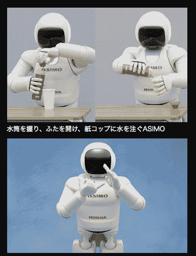

# 阿西莫:本田升级其令人敬畏的人形机器人(视频)

> 原文：<https://web.archive.org/web/https://techcrunch.com/2011/11/08/asimo-honda-upgrades-its-awesome-humanoid-videos/>

# 阿西莫:本田升级其令人敬畏的人形机器人(视频)

近年来，本田对其超级先进的人形机器人阿西莫一直保持沉默。在 2000 年推出第一个版本后，本田在 2005 年展示了几个版本，直到公司最终[今天早些时候在东京发布了](https://web.archive.org/web/20230322164005/http://www.hondanews.com/channels/corporate-headlines/releases/honda-unveils-all-new-asimo-with-significant-advancements)新版本。这款机型是迄今为止最薄、最快、最“智能”的阿西莫。

今天展示的 Asimo 重 48 公斤，比之前的型号轻 6 公斤。他现在身体里有 57 个关节(多了 23 个)，走路速度是 9 公里/小时(而不是 6 公里/小时)。

本田表示，Asimos 改进的“智能”使机器人能够跟踪不同人之间的对话，识别每个人的面孔和声音(即使几个人同时说话)。

情报部门的另一个优势是:阿西莫现在可以暂时停止某项行动，并在执行不同的任务后继续这项行动(例如打开一罐啤酒并将其倒入玻璃杯中——这在以前也是不可能的)。

如果被告知，阿西莫现在也可以用一条或两条腿踢球或开始跳跃。他现在甚至能以圆形跳跃。

这还不是全部:根据本田公司的说法，机器人“现在能够根据预设空间传感器的信息预测一个人在未来几秒钟内的行走方向，并在这个人和阿西莫的估计位置相交时，迅速决定采取替代路径以避免与这个人发生碰撞。”

机器人末日近了。

这里有一个视频(日语的，不过这种情况下没太大关系):
【YouTube = http://www . YouTube . com/watch？v = 9 CNF 8 iiy 5 Fe&w = 560&h = 315】

阿西莫端来啤酒(他自己打开易拉罐把啤酒倒进玻璃杯):
【YouTube = http://www . YouTube . com/watch？v = wyspbx 6 kq4o&w = 560&h = 315】

慢动作展示的一些新技能【ENG/JP】
【YouTube = http://www . YouTube . com/watch？v = qo 2 mcx 6k-48&w = 560&h = 315】