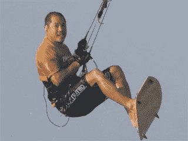

# 问一个风险投资家:风筝冲浪和风险投资是如何降低风险的

> 原文：<https://web.archive.org/web/http://techcrunch.com/2010/11/12/ask-a-vc-how-kiteboarding-and-venture-capital-became-less-risky-tctv/>

# 问一个风险投资家:风筝冲浪和风险投资是如何降低风险的

 我本周做客《向风投提问》的嘉宾是查尔斯河风险投资公司的比尔·泰。他也是专业的风筝冲浪手。你可能会问:为什么一个从 1991 年就开始做风投的人需要风筝冲浪的赞助商？这是我的第一个问题。

总的来说，在这个视频中，我们讨论了风险投资行业在过去 20 年中的变化，以及风筝冲浪在过去 10 年中的变化。有很多相似之处。这两款游戏都变得更安全、更主流，但这是否意味着它们没那么有趣了？

下面视频。