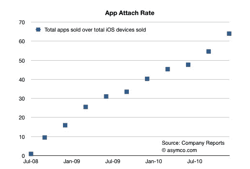

# Asmyco:每台 iOS 设备都下载了超过 60 个应用程序 

> 原文：<https://web.archive.org/web/http://techcrunch.com/2011/01/16/asmyco-each-ios-device-has-downloaded-more-than-60-apps/>

# Asmyco:每台 iOS 设备都下载了超过 60 个应用

[【as myco，](https://web.archive.org/web/20230202234742/http://www.asymco.com/)总部位于赫尔辛基的应用程序开发/行业分析咨询公司，由一位长期在诺基亚工作的经理创建并领导，刚刚[在其博客上发布了](https://web.archive.org/web/20230202234742/http://www.asymco.com/2011/01/16/more-than-60-apps-have-been-downloaded-for-every-ios-device-sold/)一份新报告，其中记录了 iOS 设备下载量增长的可观数据。

该公司报告称，每售出一台 iOS 设备，就有超过 60 款应用被下载。Asmyco 说，2008 年每台 iPhone/iPod touch 下载的应用程序只有 10 个。那么该公司是如何得出这个数字的呢？随着苹果应用商店的总下载量接近[100 亿次，](https://web.archive.org/web/20230202234742/http://content.usatoday.com/communities/technologylive/post/2011/01/apples-app-store-nears-10-billion-downloads/1)应用下载量的增长速度超过了 iTunes 音乐下载量的增长速度(当然，并不是所有的 iTunes 用户都从 iTunes 上获取音乐)。

Asmyco 随后确定，目前每天大约有 3000 万个应用程序被下载。然后，该公司将累计下载的应用程序除以累计售出的 iOS 设备数量，其中包括 iPhones、ipad 和 iPod touches。Asmyco 表示，根据这个等式，每台售出的 iOS 设备下载了超过 60 个应用程序。

当然，考虑到苹果并不经常公开更新其 iPhones、ipad 和 iPod touches 的总数，这些信息大多是主观的。随着更多设备的售出，更多的应用程序将被下载。

但 Asymco 确实引发了一个有趣的趋势——应用下载量正以惊人的速度增长，一路超越数字音乐。去年秋天，Asmyco [报道称](https://web.archive.org/web/20230202234742/https://techcrunch.com/2010/09/08/itunes-apps-songs/) iOS 应用下载量将在 2010 年底超过音乐下载总量。公司说这种情况已经发生了，但是已经很接近了。应用程序将在不到歌曲下载时间一半的时间内达到 100 亿次下载(应用程序需要 31 个月，而应用程序需要 67 个月)。)

