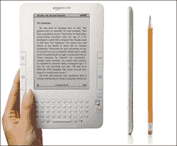

# 美国电话电报公司网络上已经有 100 万电子阅读器，不包括 iPad 

> 原文：<https://web.archive.org/web/https://techcrunch.com/2010/01/28/att-already-has-one-million-ereaders-on-its-network-without-the-ipad/>

# 美国电话电报公司网络上已经有 100 万电子阅读器，不包括 iPad

移动数据设备对 AT&T 来说是一个福音。该公司[今天早上报告了](https://web.archive.org/web/20221207200340/http://www.att.com/gen/press-room?pid=4800&cdvn=news&newsarticleid=30429)的强劲收益，第四季度利润增长了 26%。美国电话电报公司在第四季度售出了 310 万部 iPhones，这款设备被称为电信公司成功的关键驱动力之一。季度收益从去年的 24 亿美元增加到 30.1 亿美元，符合华尔街的预期。无线服务收入强劲，第四季度净增用户 270 万，同比增长 9.2%。

但美国电话电报公司的另一个增长领域是与其 3G 数据网络相连的无线阅读器。目前，亚马逊 Kindle、索尼 Reader Daily Edition 和 Barnes & Noble Nook 都在使用美国电话电报公司进行数据连接。在第四季度，美国电话电报公司无线网络上这些设备的数量增加了 100 多万台，是迄今为止此类设备增长最快的一个季度。正如我们昨天了解到的，T 公司的 T6 也将为苹果的新 iPad 提供互联网连接。

预计这一类别将继续迅猛增长，特别是随着 iPad 的加入，iPad 拥有一个名为 iBooks 的应用程序，这是苹果自己为该设备格式化的数字图书集。苹果与五家出版商合作，通过 iBooks store 销售图书。乔布斯昨天声称，iPad 将把亚马逊的 Kindle 技术提升到一个新的水平。iBooks 支持 ePub 格式，允许读者翻页，并支持图片、视频和其他图形。第一本书的价格是 14.99 美元。预计 2010 年整个电子阅读器市场将增长数百万，Forrester [预测来年将售出 1000 万台电子阅读器。该公司估计 2009 年售出了 300 万台电子书阅读器。](https://web.archive.org/web/20221207200340/http://www.readwriteweb.com/archives/holiday_outlook_for_ereaders_and_ebooks_much_bette.php)

那么这对美国电话电报公司意味着什么呢？很明显，更多的钱。该公司表示，电子阅读器设备的快速增长在一定程度上提振了其收益。美国电话电报公司最近才引进 Kindle，去年秋天亚马逊[为了 Kindle 2 放弃了 Sprint](https://web.archive.org/web/20221207200340/http://www.wired.com/gadgetlab/2009/10/sprint-kindle-att/) 。然而，虽然所有的 Kindle 都有数据套餐，但并不是所有的 iPads 都有 3G 连接。只有最贵的才会。所有型号都可以通过 WiFi 连接。