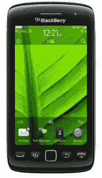
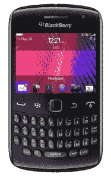

# 美国电话电报公司宣布新黑莓产品线的上市和定价 

> 原文：<https://web.archive.org/web/http://techcrunch.com/2011/11/01/att-announces-availability-and-pricing-for-new-blackberry-line-up/>

# 美国电话电报公司宣布新黑莓产品线的可用性和定价

尽管 [RIM 公司接连出错](https://web.archive.org/web/20230204102141/https://techcrunch.com/2011/06/22/rim-youre-done-here/)(包括[大规模服务器故障](https://web.archive.org/web/20230204102141/https://techcrunch.com/2011/10/10/blackberry-internet-outage-hits-europe-middle-east-africa/)导致数千名客户失去 BBM 或互联网服务……[两次](https://web.archive.org/web/20230204102141/https://techcrunch.com/2011/10/11/blackberry-internet-outage-strikes-again-while-investors-get-antsy/))，仍然有一些铁杆黑莓粉丝。如果你是他们中的一员，请放心地松一口气，因为我今天带给你的唯一消息是宣布 AT & T 的三款新黑莓机型:黑莓 Bold 9900、黑莓 Torch 9860 和黑莓 Curve 9360。

话说回来，还没到中午呢。

黑莓 Bold 9900 的外观和手感与其前辈非常相似。它配备了 RIM 紧紧抓住的标准 QWERTY 键盘，以及 2.8 英寸的触摸屏。一个 1.2GHz 的处理器，768 MB 的内存，8GB 的板载内存，一个存储卡插槽，支持美国电话电报公司的 4G 网络。你还会发现一个 500 万像素的后置摄像头，能够以 720p 拍摄视频，黑莓 7 操作系统运行该节目。这款手机已经获得了万事达卡的 PayPass NFC 认证，以及 Curve 9360。Bold 9900 将于 11 月 6 日以 199.99 美元的合同价格出售。

 接下来，我们有黑莓 Torch 9860，这是第一款在& T 上市的全触摸黑莓手机。它配有 3.7 英寸的触摸屏，除了 PayPass 认证之外，几乎所有规格都与 Bold 9900 相同。Torch 应该是黑莓产品线中一个有趣的新成员，因为许多铁杆黑莓用户通常将消息传递(因此，全 QWERTY 键盘)作为交易的达成者。与此同时，一个没有按钮的世界正在向我们走来，因为技术世界试图让[尽可能具有触摸感应功能](https://web.archive.org/web/20230204102141/https://techcrunch.com/2011/10/27/microsofts-vision-of-the-future-includes-touch-sensitive-everything-and-beautiful-people-only/)。Torch 9860 将于 11 月 6 日以 99.99 美元的合同价格出售，与 Bold 同一天。

 最后，但同样重要的是，我们有黑莓 Curve 9360，其支持闪光灯的 500 万像素摄像头能够以 720p 拍摄视频。这款手机拥有 2.44 英寸的显示屏和 800MHz 的处理器，而黑莓 7 OS 则独领风骚。AT & T 表示，这款手机将推出不带摄像头的版本，但没有具体说明这款手机的价格是否会下降。Curve 将比其他两款晚推出，11 月 20 日的合约价为 29.99 美元。政府官员和企业客户将在 11 月 14 日获得优先购买权。