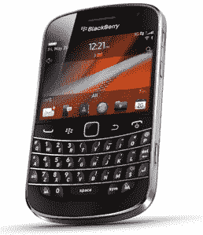
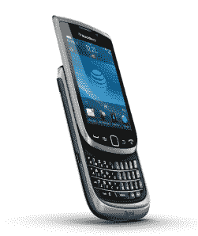
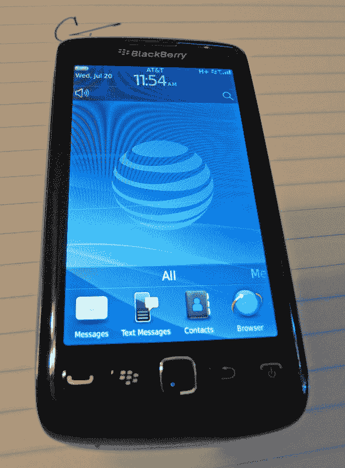

# 美国电话电报公司宣布他们的下三款黑莓手机:Torch 9810、Bold 9900 和 Torch 9680 TechCrunch

> 原文：<https://web.archive.org/web/http://techcrunch.com/2011/08/03/att-blackberry-torch-9810-9680-bold-9900/>

# 美国电话电报公司宣布他们接下来的三款黑莓手机:Torch 9810、Bold 9900 和 Torch 9680

没有什么能表明“我们对这些新产品感到非常兴奋！”比如在凌晨两点宣布。

美国电话电报公司大张旗鼓地宣布了下三款即将上架的黑莓手机，只有失眠患者和准备睡觉的人才能听到。这三款手机分别是:Torch 4G 9810(去年夏天 Torch 的后续产品[)、Bold 4G 9900 和 Torch 4G 9680(这三款手机分别是 AT&T 品牌和 Storm 的后续产品)。](https://web.archive.org/web/20230203150211/https://techcrunch.com/2010/11/07/blackberry-torch-now-available-in-red-or-white-from-att-for-99/)

美国电话电报公司目前的主要焦点似乎是 9810，因为他们提到的 Bold 9900 或 Torch 9680 的唯一细节是它们将在“今年晚些时候”推出

不过，只要自 RIM 在 5 月份宣布 9900 以来，事情没有太大的变化，我们就可以期待:

*   支持美国电话电报公司的 HSPA+(技术上不是 4G，但他们就是这么叫的)网络
*   1.2 Ghz CPU
*   黑莓操作系统 7.0
*   光学触控板
*   经典糖果棒风格的大胆设计
*   2.8 英寸 640×480 显示屏
*   8GB 内部存储
*   国家足球联盟
*   802.11b/g/n
*   500 万像素后置摄像头

用火炬 9810(被所有的数字搞糊涂了吗？我也是！就把火炬 9810 想象成“火炬 2”)，美国电话电报公司有更多的话要说。以下是我们对它的了解:

*   运行黑莓操作系统 7.0
*   HSPA+支持
*   滑出 QWERTY 键盘
*   1.2Ghz CPU
*   802.11b/g/n
*   500 万像素后置摄像头
*   8gb 的内部存储空间
*   应该会在八月份上市

唉，风暴火炬 9680 的事情变得有点模糊了。目前，我们所能得到的只是一些传闻中的规格(BB OS 7.0，1.2 Ghz CPU，和 3.7 英寸 800×480 显示屏**更新:**这些规格现在已经得到证实)和一些泄露的图片，其中最好的[上周已经发布](https://web.archive.org/web/20230203150211/http://www.pbase.com/greggebhardt/image/136573796):

