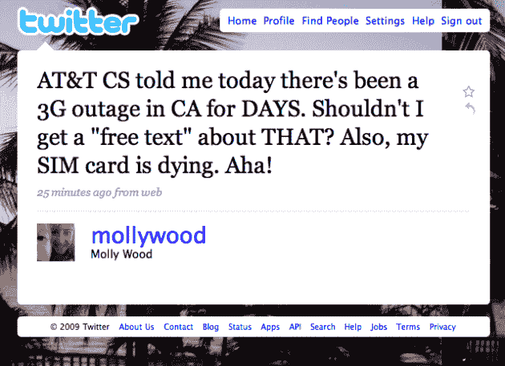
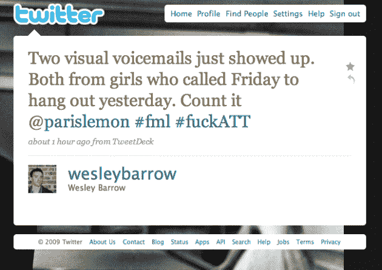
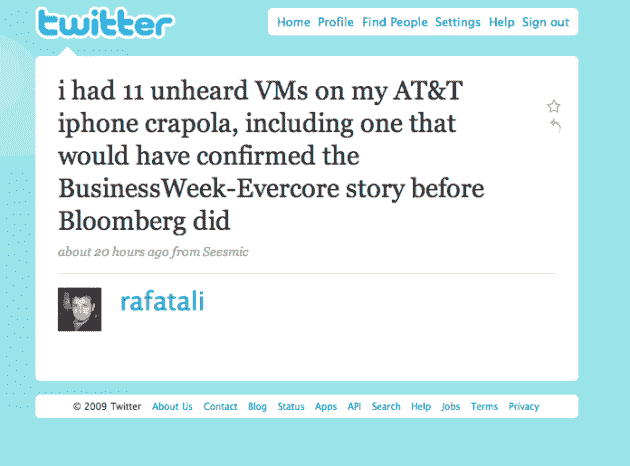

# 美国电话电报公司是一大堆热气腾腾的失败案例 TechCrunch

> 原文：<https://web.archive.org/web/https://techcrunch.com/2009/07/18/att-is-a-big-steaming-heap-of-failure/>

当 GigaOM 的 Om Malik 说[他 5 个月前因为 AT & T 的失败而和他的 iPhone](https://web.archive.org/web/20230220143813/http://gigaom.com/2009/02/11/my-big-iphone-break-up/)分手时，我必须承认，我认为他反应过度了。我错了。

自从两年前我从威瑞森搬到美国电话电报公司买 iPhone(当然，这是美国电话电报公司在美国独有的)，AT&T 就不缺缺点。但最近，我注意到事情变得越来越糟。[我不是唯一一个](https://web.archive.org/web/20230220143813/http://twitter.com/#search?q=AT%26T%20fail)。因此，是时候在这些失败上大声疾呼了。并恳求苹果*而不是*在明年与 AT & T 的独家合约到期时续约。

在我看来，最近美国电话电报公司的失败是完全不可原谅的。它的可视语音邮件系统——这是在 iPhone 上收到语音邮件的唯一方式——对许多用户来说已经关闭了几天，如果不是几周的话。而 AT & T 显然懒得告诉任何人。这是什么意思？成千上万，或者几十万，甚至几百万个错过的联系，这对于个人生活，商业和许多其他事情都是至关重要的。我简直被失败惊呆了。

我是这样发现的。昨天当我从办公室回家时，我突然收到了大量的可视语音邮件。直到那时我才意识到我已经有一段时间没有收到了。多久了？显然是从 7 月 3 日之前开始的。是的，两个星期没有一个语音信箱。

更好的是，我不仅立刻收到了这些几周前的语音邮件的狂轰滥炸，而且我仍然无法听它们。通知终于来了已经一天多了，可视语音邮件仍然关闭。我不得不手动拨打美国电话电报公司的语音信箱服务——这没什么大不了的，只是我以前从来没有这样做过，所以我不知道怎么做，我也没有收到任何通知说我必须这样做。

一旦我这样做了，果然，我收到了一系列语音邮件，从私人邮件，到我刚刚完全错过的关于约会和工作的非常重要的邮件，还有来自我 90 岁的奶奶的语音邮件，她可能认为我现在在躲着她。我不是奶奶，美国电话电报公司只是个彻头彻尾的失败者。

哦，我有没有提到一半的未接语音邮件甚至没有在我的通话记录中显示为未接来电？所以谁知道我还错过了那些懒得留语音邮件的人的什么。

我很生气，我有点想打电话给美国电话电报公司，要求他们给我错过电话的每个人打电话，亲自道歉。相反，我给他们写了这封公开的谴责信。

无论从哪个角度看，这都是非常非常糟糕的。但是，在过去的几个月和几年里，代表美国电话电报公司的一系列其他失败加剧了这一问题。

自从 iPhone 在美国电话电报公司的网络上推出以来，就一直有问题的报道。但随着去年 iPhone 3G 的推出，事情变得很糟糕，当时基本上没有人能激活他们的手机。好的，所以 T 从那个错误中吸取了教训，对吗？不——[今年](https://web.archive.org/web/20230220143813/https://techcrunch.com/2009/06/21/apple-stuck-apologizing-for-att-yet-again-with-a-30-itunes-credit/)发生了同样的事情。在那篇文章之后，AT & T 立即联系我们，表示这不是它的错，但当我们要求提供某种证明或声明时，他们没有回复我们。是啊。

让我们不要忘记在今年的 SXSW 音乐节期间 AT & T 的网络的[彻底失败。T 试图拍拍自己的背](https://web.archive.org/web/20230220143813/http://www.businessinsider.com/att-fails-the-sxsw-iphone-test-2009-3)因为它匆忙提高了带宽——这仍然没有真正发挥作用，而且来得太晚了。当然，在一个地方有大量的 iPhones 在接入网络，但是在& T 只有一个工作:为它的客户提供服务，但是它失败了。

它失败的次数太多了。取决于你在湾区的什么地方(我以此为例，因为我住在那里，但问题不仅限于这里)，基本上没有美国电话电报公司信号。这是马利克几个月前注意到的。随着越来越多的 iPhones 售出，情况越来越糟糕。

美国电话电报公司承诺网络升级即将到来，但事实是，该公司有两年多的时间来解决这些问题(自 iPhone 发布以来出现的)，但他们没有。见鬼，他们甚至连彩信和网络共享这样的基本服务都无法使用，尽管他们在其他国家的运营商已经让这些服务运行起来了。现在，您可以将可视语音邮件添加到列表中。可悲。

还有一点没有被充分提及的是，最新款的 iPhone，[3GS](https://web.archive.org/web/20230220143813/https://techcrunch.com/2009/06/08/say-hello-to-the-iphone-3gs-s-is-for-screaming-fast/)，其数据下载速度是旧款 iPhone 的两倍。但事实并非如此。为什么？因为 AT & T 的网络还不具备处理它的能力。在 2011 年之前，大多数地方都不会有。届时很可能会有两个以上版本的 iPhone。

即使在美国电话电报公司测试新的更快的网络的地方，在芝加哥，显然没有数据传输速度的差异，由 Gizmodo 进行的测试[已经证实](https://web.archive.org/web/20230220143813/http://gizmodo.com/5303999/iphone-3g-vs-3gs-network-speed-test-shows-no-real-difference)。再次，在& T 做得很好。

作为一个经常写关于 iPhone 的文章的人，我经常被人问及我是否认为他们应该现在就买一部，还是等着看它是否会在另一家运营商上市。这个答案一天比一天简单:[如果可以，就等](https://web.archive.org/web/20230220143813/https://techcrunch.com/2009/06/08/why-the-iphone-3g-s-may-be-a-suckers-bet-right-now/)。

尽管 iPhone 作为移动计算设备很棒，但它首先还是一部手机。但由于美国电话电报公司的缺点，它基本上把 iPhone 变成了 iPod touch。为什么不买一个呢？毕竟，您可以获得许多实际的工作功能，而不必每月支付高额费用。

T 公司与苹果公司的独家协议将于明年到期，他们现在正试图延长协议。我现在要说的是，如果苹果真的重新推出 AT & T，这将很容易成为它做过的最令人失望的事情之一。我认为从商业角度来看，这最终将被证明是一个巨大的错误。

我理解为什么苹果一开始只和美国电话电报公司合作(尽管它曾向威瑞森提供过这款设备，但遭到了拒绝)——它得到了一笔相当不错的交易，并能够利用它在整个行业中占据主导地位。我甚至理解他们为什么第一次提高价格——为了得到更好的交易(每卖出一部手机，美国电话电报公司就给一笔补贴)。但现在美国电话电报公司成了苹果的累赘，这将抑制其在美国的巨大增长潜力

苹果不再需要 AT&T。由于它的巨大成功，它现在可以对其他运营商发号施令，并确保它控制 iPhone 生态系统——这是它的首要任务。作为美国最大的航空公司，威瑞森可能会给它最大的阻力。但是这种抵抗是徒劳的。根据苹果的条款，iPhone [最终将登陆威瑞森](https://web.archive.org/web/20230220143813/https://techcrunch.com/2009/04/26/apple-may-hear-verizon-now/)。只是什么时候的问题。

如果到明年年底，我们中的许多人都会很开心。我不在乎违反美国电话电报公司的合同要付出什么代价，我会毫不犹豫地这么做。

如果不是明年，我会考虑换运营商，换手机吗？是的。正如我所指出的，我会很高兴随身携带一个 iPod touch，并拥有其他一些手机——即使是一个蹩脚的手机——可以正常工作。或者更有可能的是，我只是解锁 iPhone，然后在另一家运营商上使用它。在这一点上，我不在乎多少钱，我只是想要一个工作的手机。

但我不认为我必须这么做。因为我真的相信苹果必须知道，它需要扩大其在美国的运营商名单，以继续增长。如果我是一个赌徒，我会赌明年会发生这种事。

让我们尽我们所能确保这一切发生——确保苹果公司得到这个信息。每次有这些可笑的美国电话电报公司失败，就发微博，写博客，写苹果，或者大声疾呼。尽你所能，但不要只是坐在那里，并采取任何更多。

是时候发出信息了，因为美国电话电报公司不能给我们提供任何可靠的信息。

**更新**:剧情变得复杂了(AT & T 变得更糟)……来自莫莉·伍德[在推特](https://web.archive.org/web/20230220143813/http://twitter.com/mollywood/status/2715053017)上的评论:

> 美国电话电报公司政务司司长告诉我，今天有一个在加州的 3G 服务中断了几天。我不应该得到一个“免费文本”吗？

是的，我想我们都应该有。

在& T 写信给我，表达了他们对问题的关注以及对这个故事的整体反应。他们说，他们正在调查问题的报告，并正在查看推文/评论。关于上面提到的大范围的 CA 3G 中断，我的联系人说他，*“与旧金山和全国的网络官员核实过，我们不知道有像推文中提到的那样的 3G 问题。”*这似乎表明客户服务和 AT & T proper 并不一致——这一点也不奇怪。

很自然，问题的报告仍在不断涌现。这里有两个例子从个人生活和商业生活的角度突出了这个问题:

【YouTube = http://www . YouTube . com/watch？v =-jfn 5 pkzfu & w = 640 & h = 505]