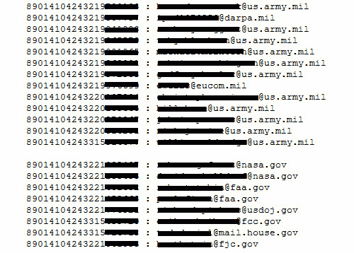
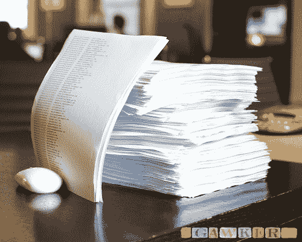

# 美国电话电报公司安全漏洞泄漏了数千 iPad 所有者的电子邮件(但幸运的是，几乎没有其他泄漏)

> 原文：<https://web.archive.org/web/https://techcrunch.com/2010/06/09/att-security-breach-leaks-thousands-of-ipad-owners-emails-but-luckily-nothing-more/>

根据 [Gawker](https://web.archive.org/web/20230319105425/http://gawker.com/5559346/apples-worst-security-breach-114000-ipad-owners-exposed) 的说法，AT & T 的一个客户身份识别脚本中的安全漏洞使得一群 4chan 黑客窃取了 [iPad](https://web.archive.org/web/20230319105425/http://www.crunchgear.com/tag/ipad/) 所有者的多达 114，000 个电子邮件地址。在& T 已经道歉，并解释了缺陷和数据泄露。实际上，一点开放信息(SIM 卡的 [ICC-ID](https://web.archive.org/web/20230319105425/http://en.wikipedia.org/wiki/Subscriber_Identity_Module#Integrated_circuit_card_identifier_.28ICC-ID.29) 与一条私人信息(iPad 所有者的电子邮件地址)相关联，因此在遇到某些 AT & T 字段时，它会自动用适当的电子邮件填充该字段。想想“记住这个密码？”通知，这些通知在您注册站点时会弹出，但级别较低。

这群黑客名为[山羊胡子安全](https://web.archive.org/web/20230319105425/http://security.goatse.fr/)(这个名字的来历我来解释一下)，他们组织了一次蛮力攻击，用半随机的 ICC-ID 号敲打一个公共的 AT & T 脚本，如果无效，该脚本将返回一个电子邮件地址(如果有效)。几个小时后，他们拿到了从迈克尔彭博到黛安·索耶的所有人的 ICC-id 和电子邮件地址，发给了埃尔德里奇，他指挥着一队 B-1 轰炸机。

就像偶尔出现的这种“灰帽”黑客行为一样，黑客似乎是先执行的，美国电话电报公司在之后不久就收到了通知，不过这并不是在数量未知的第三方访问该脚本之前。美国电话电报公司立即关闭了漏洞(这就像关闭脚本一样简单)，并道歉如下:

> 周一，一位商业客户通知美国电话电报公司，他们的 iPad ICC IDS 可能面临风险。唯一可以从 ICC IDS 导出的信息是附加到该设备的电子邮件地址。
> 
> 此问题已升级到公司的最高级别，并在周二之前得到纠正；我们实际上已经关闭了提供电子邮件地址的功能。
> 
> 发现这一差距的个人或团体没有联系 AT&T。
> 
> 我们将继续调查，并将通知所有可能已获得其电子邮件地址和 ICC IDS 的客户。
> 
> 我们非常重视客户隐私，虽然我们已经修复了这个问题，但我们向受到影响的客户道歉。

受影响。比如智齿。为什么不是“受影响？”无论如何，我注意到他们说他们不是被小组联系，而是被一些商业客户联系。从 Gawker 的文章中还不清楚时间，但我想知道是否有比任何人都愿意承认的更多的东西。像 Goatse 这样的组织通常会提前警告他们的目标，但如果发生了，他们中的一个或另一个似乎会提到。你可能会想，像美国电话电报公司这样暴露的公司，如果突然请求增加 1000%,它的脚本上会有铃声响起，但像这样的做法可能太出乎意料了。

Gawker 真的把整个名单打印出来了吗？希望不是

正如美国电话电报公司提到的，漏洞*能提供的唯一信息是一个电子邮件地址。一些高层人士(首席执行官之类的)被指出泄露的信息可能已经公开，就像我们这里的所有人一样。但我们不要忘记，在这 114，000 人中，有 113，950 人不是高层媒体高管。大量的早期采用、使用 3G 的 iPad 用户是一件有价值的事情(更不用说一个拥有一群炸弹的家伙了)，我毫不怀疑比 Goatse Security 更肆无忌惮的人会将这份名单传递给感兴趣的买家。不过，如果我们相信那些知道内情的人，就没有别的了——在这种情况下，他们没有理由欺骗我们。*

结果会是什么？对那些相关的人来说，一点额外的垃圾邮件可能是最糟糕的情况。ICC-ID 不用于任何安全访问协议。

又该怪谁呢？美国电话电报公司、美国电话电报公司和美国电话电报公司(AT&T)。苹果公司(Gawker 的标题中提到了它)应该采取措施防止类似于唯一设备 ID 的东西被用作授权，这是有争议的，但这是在延伸它。该脚本接受任何适当形式的输入，并吐出私人信息，从头到尾都是一个问题，是美国电话电报公司创建并提供了该脚本。然而，苹果也不能幸免:许多在明天的报纸上听到这个消息的人不会选择将设备制造商和服务提供商分开。最糟糕的是，他们除了说“嘿，我们致力于安全”之外别无选择，并对安全指指点点。

你能做什么？如果你是 iPad 3G 客户，打电话给客服，要求合理的满足。几个月的免费无限制 3G 可能会很不错，你不觉得吗？当然，还有他们总是风度翩翩的首席执行官。我相信他希望收到您的来信(请每位客户限发一封电子邮件)。

[故事的其余部分(和持续更新)可以在 Gawker 上找到。](https://web.archive.org/web/20230319105425/http://gawker.com/5559346/apples-worst-security-breach-114000-ipad-owners-exposed)

**更新** : Goatse Security 在一次采访中[为他们的行为](https://web.archive.org/web/20230319105425/http://www.computerworld.com/s/article/9177991/iPad_e_mail_hackers_defend_attack_as_ethical_?source=rss_news)辩护说是合法和道德的，我基本上同意。他们在执行完脚本后，向第三方透露了这个漏洞(这解释了我在上面提到的声明差异)。