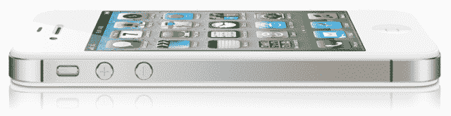

# 美国电话电报公司的 iPhone 4S 激活量超过 100 万

> 原文：<https://web.archive.org/web/http://techcrunch.com/2011/10/20/att-surpasses-1-million-iphone-4s-activations/>

# 美国电话电报公司超过 100 万 iPhone 4S 激活

看起来 iPhone 4S 是一个了不起的破纪录者。苹果在手机上市的第一个 24 小时内就记录了超过 100 万的预购订单，t 2 在第一个周末就卖出了 400 万部手机。这是其他任何 iPhone 首周末销量的两倍。

但是 iPhone 4S 不仅仅打破了苹果公司的记录。

美国电话电报公司刚刚宣布其 iPhone 4S 激活量已经突破 100 万。迄今为止，美国电话电报公司从未在一次 iPhone 发布会上见过如此多的激活，这说明了很多问题，因为蓝色巨人是自 iPhone 首次进入市场以来唯一拥有 iPhone 的运营商。

威瑞森将于明天发布其激活统计数据，届时我们将能够对这些数字有更多的了解。与此同时，值得注意的是，美国电话电报公司也一直在扩大其 Android 业务，Android 销售额同比翻了一番。

