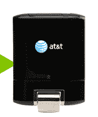

# 美国电话电报公司首批 LTE 设备将于 8 月 21 日发布(在其 LTE 网络建成之前)TechCrunch

> 原文：<https://web.archive.org/web/https://techcrunch.com/2011/08/16/atts-first-lte-devices-to-launch-on-august-21st-before-their-lte-network-is-up/>

# 美国电话电报公司首批 LTE 设备将于 8 月 21 日发布(在他们的 LTE 网络建成之前)

厌倦了等待美国电话电报公司发布他们的首款 LTE 设备？是的——看起来美国电话电报公司也是。事实上，他们正准备在下周早些时候推出他们的第一批 LTE 设备…在他们的 LTE 网络正式启动之前。

那么，为什么要在 LTE 网络建立并准备好之前推出这些设备呢？因为它让他们说他们有 LTE 设备，当然。此外，在某种程度上，他们仍将工作在 T1，他们只是被限制在不完全是 4G，但他们称之为 4G 的 HSPA+网络，直到今年夏天晚些时候 LTE 开始点亮。

现在，在我的手机极客伙伴们变得过于激动之前:在最近似乎是运营商的一种趋势中，美国电话电报公司在新网络上运行的第一批设备将不是手机——它们是笔记本电脑共享设备。

对于孤独的出差族，美国电话电报公司推出了 USBConnect Momentum(右图)，它可以通过 USB 将你的笔记本电脑接入 LTE 网络。对于成群漫游的人来说，他们正在推出 Elevate(上图)，这是一个类似 MiFi 的 4G 无线热点(打开它，让它连接到 4G 网络，并通过 WiFi 连接最多 5 个设备)。两者都将于 8 月 21 日发布，尽管这些东西的价格标签似乎仍然保密。 ( **更新:**看起来 Momentum 两年期合同的价格是 50 美元，而 Elevate 是 70 美元。)

美国电话电报公司还借此机会确认了 LTE“纯数据移动宽带”设备(理解为:不是电话)的每月定价:每月 50 美元可以获得 5gb 的流量，每使用一个 GB 就要多花 10 美元。数据的未来看起来仍然非常昂贵。