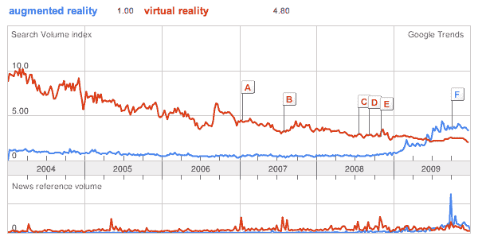

# 增强现实与虚拟现实:哪个更真实？TechCrunch

> 原文：<https://web.archive.org/web/https://techcrunch.com/2010/01/06/augmented-reality-vs-virtual-reality/>

# 增强现实与虚拟现实:哪个更真实？

还记得虚拟现实风靡一时的时候吗？它运行得很好，尤其是在 20 世纪 90 年代，也许在刚刚结束的十年里以第二人生达到高潮。但是虚拟现实已经过时了。如今，人们对[“增强现实”](https://web.archive.org/web/20221006054511/http://en.wikipedia.org/wiki/Augmented_reality)更感兴趣，或者至少他们在谷歌上搜索，去年夏天的某个时候[超过了](https://web.archive.org/web/20221006054511/http://www.google.com/trends?q=augmented+reality,+Virtual+Reality&ctab=0&geo=all&date=ytd&sort=0)作为搜索词(见图表)。

也许人们更多地寻找它只是因为他们不确定它意味着什么，但它肯定正在进入集体意识。如果虚拟现实是完全沉浸在数字世界中，增强现实(AR)则更像是现实世界的数字叠加。它用数字数据增强了真实世界，因此比完全虚构的环境有趣得多。增强现实应用有一个神奇的元素，因为它们把数据和图形并置在它们本不该出现的地方。

iPhone 和 Android 手机等带 GPS 和摄像头的触摸屏手机的出现，引发了一系列 AR 应用，包括 Sekai Camera、Layar、more 和 T14。一般来说，这些应用程序通过手机的摄像头显示你周围的世界，但除了充当取景器，你的屏幕还可以充当普通的电脑屏幕。在 GPS 和车载指南针的帮助下，它可以将信息或图形放置在通过取景器看到的建筑物或物体的顶部。

但这仅仅是开始。大学研究实验室如雨后春笋般涌现，探索增强现实作为一种新的计算界面。最新的 AR 应用是[鹦鹉 AR。无人机](https://web.archive.org/web/20221006054511/http://www.parrot.com/)，并将飞行遥控玩具与 iPhone 应用程序相结合。该应用程序将 iPhone 变成了一个遥控器(我们已经看到[将这个概念应用于视频游戏](https://web.archive.org/web/20221006054511/http://www.beta.techcrunch.com/2009/09/14/tc50-control-any-pc-game-with-your-iphone-with-imo/))，但无人机上还有一个摄像头，让你从它的角度看，并与其他无人机玩虚拟射击游戏。拍摄发生在屏幕上，而现实生活中的玩具在空中飞行。还有一个单人模式，你可以在屏幕上拍摄敌人的喷气式飞机，并置在你的客厅或任何你碰巧驾驶无人机的地方。(看下面的视频就明白我的意思了)。

你可以带着你的虚拟现实在第二人生里迷失。我哪天都会选增强现实。只是更真实而已。