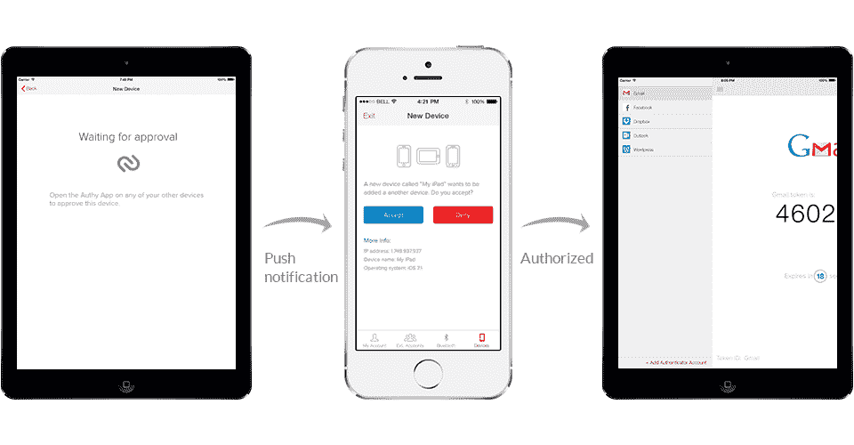

# Authy 现在允许您在多台设备上使用其双因素认证系统 

> 原文：<https://web.archive.org/web/https://techcrunch.com/2013/11/21/authy-goes-where-no-two-factor-authentication-system-has-gone-before-to-multiple-devices/>

# Authy 现在允许您在多个设备上使用其双因素身份验证系统

双重认证是保证你的账户安全的最有效的方法之一，但是这也意味着如果你丢失了手机并且没有备份密码，你将不能阅读你的邮件或者登录你的 WordPress 博客。 [Authy](https://web.archive.org/web/20221203124108/http://authy.com/) ，一家专注于让双因素认证更容易使用的初创公司，希望[通过允许你从多台设备上获得第二因素认证码，让这成为过去](https://web.archive.org/web/20221203124108/http://blog.authy.com/multi-device)。

正如 Authy 的创始人丹尼尔·帕拉西奥(Daniel Palacio)本周早些时候告诉我的那样，该公司预计这一举措会有些争议。如今，几乎所有双因素身份认证系统都设置为仅在单个设备上工作。有些，比如 Google Authenticator，可以在多种设备上使用，但 Palacio 认为这是由于糟糕的设计选择，而不是真正的预期用例。

使用 Authy，用户可以通过继承的信任系统将新设备添加到他们的列表中。当用户在新设备上设置应用程序时，他们将在之前授权的设备上收到推送通知，以确认新设备可以信任。如果你丢失了你的一个设备，你可以从另一部手机或平板电脑上取消授权。为了做到这一点，Authy 使用多密钥系统来确保为您的每台设备生成不同的密钥。不过，用户不必担心所有这些细节。对他们来说，登录过程完全一样。

正如帕拉西奥所承认的，这一举动可能会引起一些争议。他承认，增加更多的设备也会增加攻击媒介的数量，但 Authy 团队认为该系统的优势超过了这些问题。

他告诉我，首先，在丢失设备和关闭设备之间通常会有很长一段时间。这个新系统可以让你从平板电脑上停用手机上的 Authy 应用程序。“整合多种设备解决了用户面临的许多问题，应该成为任何现代多因素身份认证系统的一部分，”Palacio 今天在博客文章中写道[。](https://web.archive.org/web/20221203124108/http://blog.authy.com/multi-device)

Authy 团队还注意到的一点是，大多数双因素身份认证用户要么不生成离线备份代码，要么将它们存储在不安全的地方。对他们来说，使用第二个设备实际上可能比使用备份代码更安全。