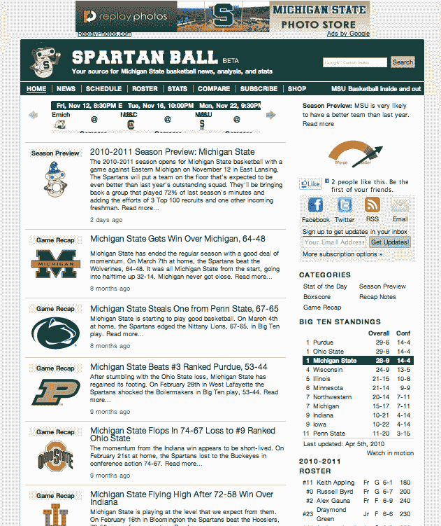

# 自动化新闻通过 stat sheet-TechCrunch 进入体育报道

> 原文：<https://web.archive.org/web/http://techcrunch.com/2010/11/12/automated-news-sports-statsheet/>

机器人体育记者来了。虽然媒体行业的人担心像 Demand Media 这样的内容工厂和相关内容会产生由低收入互联网作者撰写的无休止的 SEO 文章，但至少这些文章仍然是由人类撰写的。我们可能不再需要人类，至少对于数据驱动的故事来说。

北卡罗莱纳州的一家初创公司 [StatSheet](https://web.archive.org/web/20220812225139/http://statsheet.com/) ，今天推出了一个由 345 个体育网站组成的卓越网络，其中一个网站专门面向美国的每一个 1 级大学篮球 tam。例如，有一个网站面向[密歇根州立大学斯巴达队](https://web.archive.org/web/20220812225139/http://spartanball.com/)、[北卡罗莱纳州焦油脚跟队](https://web.archive.org/web/20220812225139/http://carolinaupdate.com/)和[俄亥俄州七叶树队](https://web.archive.org/web/20220812225139/http://buckeyesbeat.com/)。每个网站上的每个故事都是由机器人编写的，或者更准确地说，是由 StatSheet 的内容算法编写的。“帖子完全是自动生成的，”创始人罗比·艾伦说。"人类唯一的参与就是创建生成帖子的算法."

StatSheet 最初基本上是一个体育迷的统计数据库。它存储了大部分主要运动项目的 5 亿种不同的统计数据。现在，它正在利用所有这些数据并从中创造新闻故事。它有大约 20 种不同类型的文章，从赛季预览到比赛摘要。StatSheet 可能会分析 10，000 个数据点和 4，000 个可能的短语来生成一个故事。

结果令人惊讶地可读，如果有点干。这里有一个典型的 [lead](https://web.archive.org/web/20220812225139/http://spartanball.com/michigan-state-basketball/game-recap/michigan-state-gets-win-over-michigan-64-48) ，它是从去年三月的一场比赛的统计数据中生成的，用于预先填充网站。：

> 密歇根州立大学以良好的势头结束了常规赛。3 月 7 日主场，斯巴达 64-48 战胜狼獾。从一开始就是密歇根州立大学，到半场结束时 32-14 领先。密歇根从未接近过。
> 
> 这场对决的一些事实:密歇根州立大学的 RPI 排名远远高于密歇根大学(从第 26 位到第 130 位)。斯巴达主场优势明显，狼獾没有动力，5 战 3 负。斯巴达人今年已经看到了狼獾，这场胜利让我们在常规赛中横扫对手。

这不完全是引人入胜的体育新闻，但如果你想要的是事实，这就够了。如果可能的话，我还是更愿意阅读 SB Nation 上的体育博客或者 ESPN 的文章。但是与一些内容工厂的东西相比，这还不算太差。345 个队址中的每一个都将拥有自己的 Twitter 账户(这是对 [StatTweets](https://web.archive.org/web/20220812225139/https://beta.techcrunch.com/2008/12/17/sports-fans-keep-up-with-your-teams-on-stattweets/) 的复兴)、Facbook 粉丝页面和移动应用程序，以便更容易地跟上比分和比赛。

