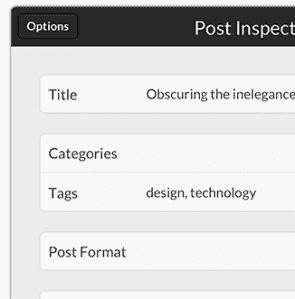

# Automattic 收购 iOS WordPress 客户端海报以改进其移动应用 

> 原文：<https://web.archive.org/web/https://techcrunch.com/2013/06/17/automattic-acquires-ios-wordpress-client-poster-to-improve-its-own-mobile-apps/>

# Automattic 收购 iOS WordPress 客户端海报以改进其自己的移动应用程序

WordPress 的母公司 Automattic 已经[收购了广受欢迎的 iOS WordPress 客户端](https://web.archive.org/web/20230219103001/http://www.tomwitkin.com/poster/acquired/) [Poster](https://web.archive.org/web/20230219103001/http://www.tomwitkin.com/poster/) 。它的唯一开发者汤姆·威特金将加入 WordPress 移动团队。今年 1 月推出 2.0 版本的 Poster 已经从 App Store 中[下架](https://web.archive.org/web/20230219103001/https://itunes.apple.com/us/app/poster-wordpress-blog-editor/id549006481?mt=8)，但是之前购买过的用户可以重新下载。威特金也承诺继续支持。

 对于 Automattic 来说，这是一个聪明的举动。Poster 一直是最优雅、最智能的移动 WordPress 客户端之一，虽然该公司自己在自己的移动应用程序方面取得了长足的进步，但他们无法与 Poster 的设计匹敌。正如 Automattic 的创始人马特·莫楞威格告诉我的，“我们已经收购了海报应用程序及其技术，我们很高兴汤姆能够为 Automattic 移动团队做出贡献。移动版 WordPress 正在快速增长，我们在这方面的投资也在快速增长。”

威特金表示，这一举措将使他能够继续做他热爱的事情——“创造能够带来快乐的应用和体验。”Poster 包括 Dropbox 集成、 [Markdown](https://web.archive.org/web/20230219103001/http://daringfireball.net/projects/markdown/) 支持和完整的 WordPress 集成，包括对自定义帖子的支持。

值得注意的是，WordPress 自己的应用程序目前没有这些高级功能，但有可能添加 Witkin 和他为 Poster 开发的一些代码将很快进入官方客户端。