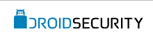

# AVG 以高达 940 万美元收购移动安全初创公司 droid Security 

> 原文：<https://web.archive.org/web/https://techcrunch.com/2010/11/10/avg-droidsecurity/>

# AVG 以高达 940 万美元收购移动安全初创公司 DroidSecurity

安全软件制造商 [AVG Technologies](https://web.archive.org/web/20230202213326/http://free.avg.com/ww-en/homepage) 已经从以色列[的创始人和投资者手中收购了以色列](https://web.archive.org/web/20230202213326/http://www.droidsecurity.com/)的 droid security[据报道价值 410 万美元](https://web.archive.org/web/20230202213326/http://www.globes.co.il/serveen/globes/docview.asp?did=1000600089&fid=1725)收益高达 530 万美元，取决于业绩里程碑。

DroidSecurity 提供的产品旨在保护运行谷歌 Android 操作系统的智能手机、平板电脑和其他设备免受病毒和恶意软件的攻击。该公司的 Android 平台移动安全应用程序 [ANTIVIRUSFree](https://web.archive.org/web/20230202213326/http://www.droidsecurity.com/products.html) 上个月超过了 450 万次的下载里程碑，是排名第一的应用程序。

AVG 表示，此次收购使其移动解决方案团队能够为其超过 1.1 亿用户扩展可用的安全产品，以包括不断扩大的移动安全领域。

Gartner 刚刚发布了一份报告，显示 Android 的市场份额已经超过 25 %,这意味着它目前是全球第二大最受欢迎的移动操作系统。

交易完成后，根据惯例的成交条件和监管批准，DroidSecurity 将成为 AVG 的全资子公司，并将继续把总部设在以色列的特拉维夫。其首席执行官兼联合创始人 Eran Pfeffer 将成为 AVG 移动解决方案团队的总经理。

DroidSecurity 于 2009 年由 Pfeffer 与 [Dror Shalev](https://web.archive.org/web/20230202213326/http://www.crunchbase.com/person/dror-shalev) 和 [Omri Sigelman](https://web.archive.org/web/20230202213326/http://www.crunchbase.com/person/omri-sigelman) 共同创立。

据《环球时报》报道，DroidSecurity 部分由经理和员工所有，部分由投资者 [Maayan Ventures](https://web.archive.org/web/20230202213326/http://www.crunchbase.com/financial-organization/maayan-ventures) 以及由 [Quantumwave Capital](https://web.archive.org/web/20230202213326/http://quantumwave.net/) 合伙人 Shachar Efal 领导的一群私人支持者所有。