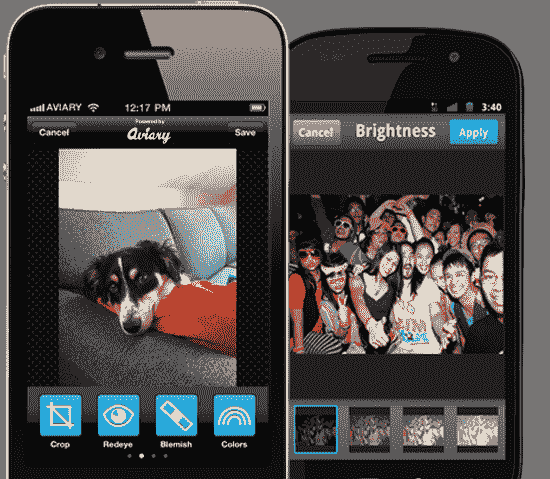

# Aviary 允许开发人员在他们的 iPhone、Android 应用程序 TechCrunch 中添加很酷的照片编辑功能

> 原文：<https://web.archive.org/web/http://techcrunch.com/2011/09/13/aviary-lets-developers-add-cool-photo-editing-features-to-their-iphone-android-apps/>

# Aviary 允许开发者在他们的 iPhone、Android 应用程序中添加很酷的照片编辑功能

这些年来，Aviary 凭借其强大的[照片编辑](https://web.archive.org/web/20230203142425/https://techcrunch.com/2010/11/23/aviary-html5-photo-editor/)和其他工具以及用于网络和移动设备的 [API](https://web.archive.org/web/20230203142425/https://techcrunch.com/2008/02/05/aviary-invites-readers-to-try-their-online-design-suite/) 为自己的[赢得了声誉](https://web.archive.org/web/20230203142425/https://techcrunch.com/2008/02/05/aviary-invites-readers-to-try-their-online-design-suite/)。

今天，他们在某种程度上改变了路线，从商业角度来说，从今以后主要集中于[用软件开发包(SDK)服务广大的开发者社区](https://web.archive.org/web/20230203142425/http://developers.aviary.com/)。

使用他们的 SDK，iOS 和 Android 应用程序开发人员可以在他们的应用程序中添加照片编辑功能，如裁剪、锐化、消除红眼、滤镜和效果等。Aviary 表示，对 iPad 的支持正在进行中，其 SDK 与即将推出的 iOS 5 完全兼容。

iPhone 和 Android SDK 都可以免费使用和实现。开发人员能够定制照片编辑功能，使其符合他们应用程序的外观和感觉。

Aviary 与 30 多个合作伙伴一起推出了新的 SDK。该公司还进行了一次重要的招聘，吸引了前微软参谋长保罗·墨菲作为他们新的业务发展副总裁来领导其合作伙伴关系。

[推出合作伙伴](https://web.archive.org/web/20230203142425/http://blog.aviary.com/see-whos-integrating-aviarys-mobile-sdks/)包括 picplz、Minus、Snapr、Fashism、Getaround、Pixable 和 Fotobabble。

