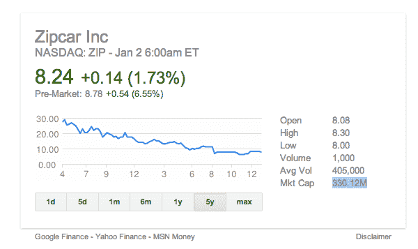

# 汽车租赁公司 Avis 以 5 亿美元收购 Zipcar 

> 原文：<https://web.archive.org/web/https://techcrunch.com/2013/01/02/avis-to-buy-zipcar-for-500-million/>

# 汽车租赁公司 Avis 以 5 亿美元收购 Zipcar

汽车租赁公司 Avis [宣布](https://web.archive.org/web/20221018154739/https://www.globenewswire.com/news-release/2013/01/02/514160/10016798/en/Avis-Budget-Group-to-Acquire-Zipcar-for-12-25-Per-Share-in-Cash.html)打算以 5 亿美元收购汽车共享公司 Zipcar，据 T2 的一份新闻稿称，该收购预计将于 2013 年春季完成。Zipcar 本身[于 2011 年 4 月上市](https://web.archive.org/web/20221018154739/https://beta.techcrunch.com/2011/04/14/zipcar-shares-up-over-50-market-cap-surpasses-1-billion-after-ipo/)。

Avis 首席执行官 Ronald L. Nelson 在公告中表示:“通过与 Zipcar 的合并，我们将大大提高我们在美国和国际上的增长潜力，并将使我们的公司能够更好地服务于更广泛的消费者和商业运输需求。”

ZipCar 在 IPO 交易的第一天早上以每股 18 美元开始，当天其股票最终飙升至 27.96 美元，涨幅超过 50%。交易结束时，它已经是一家价值 10 亿美元的公司，市值是今天收购价格的两倍多。

自首次公开募股以来，这家最近盈利的公司——在美国、英国和加拿大的 20 个不同城市和 300 多个大学校园拥有超过 76 万名会员——的股票表现不太出色。在过去两年中，它的上市后价值损失了近三分之二，今天的收购比 2012 年 12 月 31 日的收盘价溢价 49%。

收购在春季完成后，Zipcar 团队将继续其计划中的搬迁，Avis 预计 Zipcar 首席执行官 Scott Griffith 和首席运营官 Mark Norman 将继续运营新的 Avis/Zipcar 子公司。Avis 预计，合并将每年节省 5000 万至 7000 万美元，包括维护和资助 Zipcar 车队的昂贵过程。

在首次公开募股之前，Zipcar 已经从 Revolution Living，Globespan Capital，Benchmark Capital Partners，Greylock Partners 和 Smedvig Capital 获得了 6070 万美元的资金，并在公开募股中筹集了 1.74 亿美元。

**