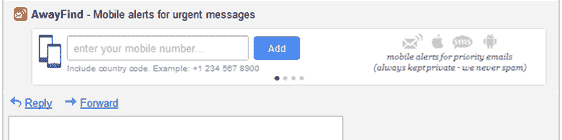
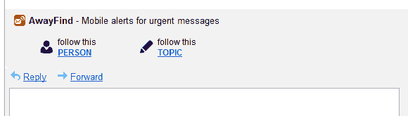

# AwayFind 筹集了 80 万美元的种子资金，现在可用于 Google Apps TechCrunch

> 原文：<https://web.archive.org/web/http://techcrunch.com/2011/10/12/awayfind-raises-800000-in-seed-funding-now-available-for-google-apps/>

# AwayFind 筹集了 80 万美元的种子资金，现在可用于谷歌应用程序

电子邮件生产力工具 [AwayFind](https://web.archive.org/web/20230204104212/http://awayfind.com/) 今天宣布，它已经完成了 80 万美元的种子轮投资，由 500 家初创公司和 CAP Ventures 领投，几位天使投资人参与其中，包括本·李林塔尔、安东·萨顿和阿米尔·巴尼法特米。

该公司还推出了其用于商业的[新产品](https://web.archive.org/web/20230204104212/http://awayfind.com/google-apps.php)，现在可以在[谷歌应用程序市场](https://web.archive.org/web/20230204104212/https://www.google.com/enterprise/marketplace/viewListing?productListingId=4925+9424300573372110328&pli=1)买到。这项新服务包括一个集成的 Gmail 小工具，每月 10 美元起的新订阅计划和即时提醒。

如果你对 AwayFind 不熟悉，该公司为解决“电子邮件超载”的情况提供了奇怪的、被忽视的、但疯狂的实际需求。AwayFind 让您配置何时以及如何提醒您紧急邮件，而不是经常检查您的收件箱中的重要邮件，使用通过短信、电话(是的，以前的学校电话！)或在 iPhone 或 Android 设备上运行的智能手机应用程序。

显然，AwayFind 的收入货币化选项的目标市场是商业客户，这就是为什么今天的 [Google Apps 提供](https://web.archive.org/web/20230204104212/http://awayfind.com/google-apps.php)是有意义的。这项更专业的服务包括一个管理控制面板，使 it 部门能够为 Google Apps 用户提供 AwayFind，检查账户问题并管理系统。和以前一样，AwayFind 使用 oAuth 进行 Google Apps 邮件检查，并且完全兼容 PCI。

谷歌表示，谷歌应用程序用户自己可以在 Gmail 中设置 AwayFind，这个过程只需一分钟左右。一旦整合，用户将在他们的电子邮件旁边看到新的链接，让他们只需点击就可以快速跟踪一个人或主题。

公司范围内的计费选项是可用的，此外还有针对非谷歌应用程序用户的新计划，比如每月 5 美元的个人计划(以前是每月 15 美元)，可以在 5 分钟内发出提醒。每月专业计划和最大计划也可用于那些需要更快的提醒或谁想要配置多个电子邮件帐户。

更多详情请见[这里](https://web.archive.org/web/20230204104212/http://www.awayfind.com/google-apps.php)。

