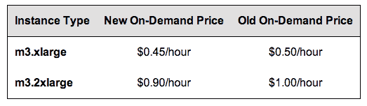

# AWS 为高流量应用程序设计的实例在所有地区降价 10% 

> 原文：<https://web.archive.org/web/https://techcrunch.com/2013/11/05/aws-drops-prices-10-across-all-regions-for-instances-designed-for-high-traffic-apps/>

# AWS 在所有地区为高流量应用程序设计的实例降价 10%

亚马逊网络服务(AWS)为其 M3 实例降价 10 %( T1 ),这些实例是为媒体编码、批处理、缓存和网络服务而设计的。

降价将于 11 月 1 日生效，并覆盖所有 AWS 地区。大约在去年的这个时候，AWS 推出了第二代实例，与第一代实例相比，其绝对 CPU 性能提高了 50%，并且是为具有高流量内容管理系统的应用程序和 memcached 应用程序等应用程序而设计的。

根据 AWS，有两种第二代标准实例类型，它们都是 64 位平台:

*   超大型实例( **m3.xlarge** )拥有 15 GB 内存和 13 个 ECU (EC2 计算单元)，分布在 4 个虚拟内核上，具有中等 I/O 性能。
*   双超大实例( **m3.2xlarge** )拥有 30 GB 内存和分布在 8 个虚拟内核上的 26 个 ECU，具有高 I/O 性能。

去年的引入使实例类型总数达到 17 种，跨越 7 个不同的系列。

价格下降情况如下:

价格下降的消息是在定于下周在拉斯维加斯举行的 AWS re:Invent 前夕发布的。在去年的活动中，该公司跟随 M3 新闻[将 EC2 云计算平台上](https://web.archive.org/web/20221226081004/https://techcrunch.com/2013/07/10/amazon-drops-price-of-ec2-dedicated-instances-by-up-to-80/)[专用实例](https://web.archive.org/web/20221226081004/http://aws.amazon.com/dedicated-instances/)的价格降低了 80%。专用实例适用于专用于单个客户的单租户硬件。

下周更多 AWS 价格下降？如果我是个赌徒，我会说是的。

(专题图片 [via homedit。](https://web.archive.org/web/20221226081004/http://www.homedit.com/the-cloud-house/)