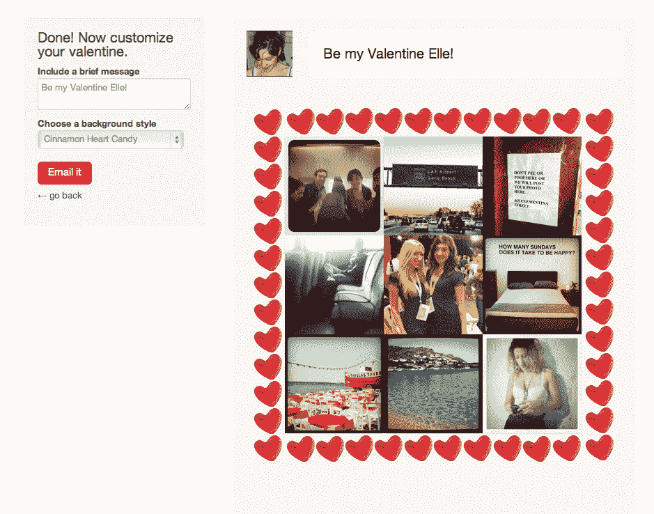

# Instagram 创始人的女朋友学习如何为 V-Day 编码，建立 Lovestagram TechCrunch

> 原文：<https://web.archive.org/web/https://techcrunch.com/2012/02/09/awwwwwwwwwwwwwwwwww/>

这可能是我听过的最甜蜜的情人节故事了。这绝对是我写过的最甜蜜的情人节故事。

[Kaitlyn Trigger](https://web.archive.org/web/20221208141732/https://twitter.com/#!/kaitlyntrigger) 是 Rally.org[的营销总监](https://web.archive.org/web/20221208141732/http://www.rally.org/)。她也是 [Instagram](https://web.archive.org/web/20221208141732/http://www.instagram.com/) 联合创始人[迈克·克里格的](https://web.archive.org/web/20221208141732/http://www.crunchbase.com/person/mike-krieger)两年半的女友(26 岁的克里格和 27 岁的 Trigger 于 2009 年 10 月在朋友家相遇，并于 2010 年 10 月同居)。我的英雄。

去年 12 月，Trigger 决定，她希望能够与她的男朋友深入谈论他正在研究的东西。因此，这位“从未上过任何计算机课”的耶鲁政治学专业学生偷偷下载了[“艰难地学习 Python”](https://web.archive.org/web/20221208141732/http://learnpythonthehardway.org/)，开始了编程之旅，截止日期是情人节。

她的目标？创建现在的 [Lovestagram](https://web.archive.org/web/20221208141732/http://lovestagram.com/) ，一种将你与特定人分享的 Instagram 照片转化为电子情人节的方式。“几个月前，我绞尽脑汁为两个刚刚订婚的朋友准备礼物。我想找到他们有共同点的 Instagram 照片，这很难！”

在她学会 Python 之后，Trigger 必须完成一个 [Django](https://web.archive.org/web/20221208141732/https://www.djangoproject.com/) 教程，以便将 Python 上线——她使用 Heroku 将内容推送到网络服务器。为了在 2 月 14 日之前完工，她花了马拉松式的周末来建设这个网站，在马丁·路德·金假日离开公寓总共三个小时。

“学习编程并不难。最大的挑战是弄清楚 web 应用程序的所有活动部分是如何组合在一起的。没有这方面的书，”她说。

要使用 Lovestagram，只需登录你的 Instagram 帐户，输入你心爱的人的名字，并从三个可爱的设计中选择一个，Lovestagram 彩虹，粉色相机先生和肉桂心糖果(顺便说一下，我在写这篇文章的整个时间里一直在不停地“Awwing”。).然后你可以定制信息并发送给你的情郎。

这是凯特琳发给迈克的 [Lovestagram](https://web.archive.org/web/20221208141732/http://lovestagram.com/show_valentine/8871083d211f49f1ae696c3cd7ceb46d/) ，是的，她确实写道，“就像 Instagram 滤镜一样，你让我的世界变得更加美丽。”是的，她还必须学习 Photoshop 来做出三种不同的设计，“这几乎比 Python 难，”她告诉我。

虽然这项服务最终看起来令人惊叹，但她对克里格保密的计划没有奏效，主要是因为她对解决 bug 感到沮丧，“有些东西会花我一个半小时，我知道 10 英尺外的人可以在 10 秒钟内修复相同的 bug。”所以她说漏了嘴。

“迈克真的很感动，”她说。“他在整个过程中的支持真的是一份礼物。在我胡思乱想的时候容忍我。”Trigger 认为她的技能的物理表现和技能本身都是 V 日礼物，“[但是]我们有一个共同点的事实是更大的礼物。”

作为一个可能在某个时候和程序员约会过的人，当 Trigger 描述 Krieger 坐在电脑前的状态为“不知道他在做什么”时，我感觉到了她的痛苦。“在一个大多数男人是软件工程师，而大多数女人不是的城市里，这很难，”她说(我也尝试过学习 Python，但失败了——稍后会有更多的介绍)。

Trigger 建议专门为想要编码的女性开设课程，作为解决这一特殊数字鸿沟的可能方案，诀窍是不要被吓倒，“[编码]是任何人都不应该害怕的东西。”

这也是你不一定需要一个重要的另一半的事情。你能给的最好的编码技能情人节礼物，就是你给自己的编码技能情人节礼物。