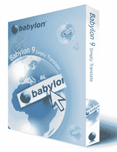
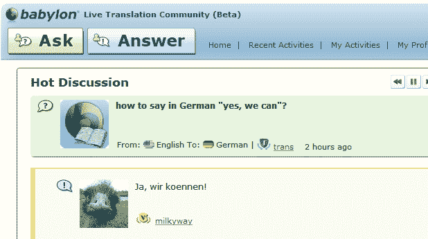

# Babylon 的目标是从其 7200 万会员中建立一个“语言学 Quora”

> 原文：<https://web.archive.org/web/http://techcrunch.com/2011/01/26/babylon-aims-to-build-a-quora-for-linguistics-off-its-72-million-members/>

# 巴比伦的目标是为其 7200 万会员建立一个“语言学 Quora”

[Babylon](https://web.archive.org/web/20230202233054/http://www.babylon.com/) ，翻译和词典软件及语言解决方案的上市供应商，自 1997 年成立以来一直在[左右。今天，该公司推出了旗舰翻译产品的第 9 版](https://web.archive.org/web/20230202233054/http://www.crunchbase.com/company/babylon)[,试图将它变成名副其实的“语言学 Quora”(他们的话)，参考了 2009 年 6 月推出的 Q & A 初创公司。](https://web.archive.org/web/20230202233054/http://www.babylon.com/products/babylon/)

Babylon 表示，它可以利用大约 7200 万会员将其改进后的产品转变为一个语言社区，允许用户互相帮助任何翻译、语言建议或关于当地文化的提示。

此外，Babylon 还与一家名为 [Ginger Software](https://web.archive.org/web/20230202233054/http://www.gingersoftware.com/) 的公司合作，该公司提供上下文拼写和语法检查器。

这种合作关系的目标是能够为其数百万用户提供一种——我引用一下——“校对、理解上下文的数字写作辅助工具，能够将任何文档塑造成完美无缺的书面作品。

Babylon 适用于 Windows、Mac、iPhone、黑莓和 Android 设备。

该公司声称，它每天处理大约 9000 万次翻译请求，其软件每天被下载超过 10 万次。其数据库包含约 1800 万个定义术语，每天有 350 万人访问该网站。

除了社交方面，其翻译软件第 9 版的新功能是让你的电脑用英语、德语、法语等为你朗读。巴比伦所谓的人类语音引擎提供超过 18 种语言的发音。

