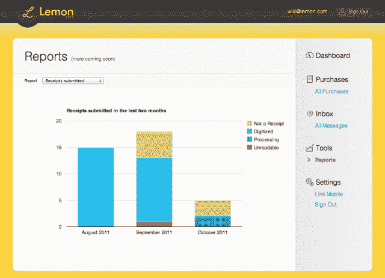

# 在 1000 万美元的资金支持下，Lemon.com 让你可以在云端存储、组织你的收据 

> 原文：<https://web.archive.org/web/http://techcrunch.com/2011/10/13/backed-by-10m-in-funding-lemon-com-lets-you-store-organize-your-receipts-in-the-cloud/>

# 在 1000 万美元的资金支持下，Lemon.com 允许你在云端存储、组织你的收据

今天， [Lemon](https://web.archive.org/web/20230203075446/http://lemon.com/) 正式发布，这是一款免费的基于云的收据管理器和支出跟踪器，适用于 [Android 和 iOS 设备](https://web.archive.org/web/20230203075446/http://lemon.com/download/)(黑莓和 Windows Phone 版本“即将推出”)。该服务允许用户在云端存储和组织电子邮件和纸质收据，以帮助他们跟踪购买情况，消除混乱，开始更明智地消费。

要上传纸质收据，人们可以下载一个移动应用程序，然后简单地拍下收据的照片。Lemon 将随后数字化并存储这些数据。

这家羽翼未丰的公司声称，来自任何零售商的数字收据都可以直接发送到一个人的 Lemon 账户(附带一个 personal @lemon.com 电子邮件地址)。

有人请通知美国在线！

不过，Lemon 不仅仅是存储数据:

> Lemon 挤出收据中包含的所有有趣的细节，帮助你保持有条不紊，看看你的钱都花到哪里去了，同时还能省下一些钱。Lemon 从每张收据中提取数据，直到产品级别的细节，以生成有洞察力的报告和图表，说明支出趋势，便于准备纳税时间或提交支出报告。
> 
> 随着时间的推移，Lemon 还将根据用户的消费习惯，向用户提供相关品牌和零售商的有针对性的折扣和促销活动，使用户能够获得独家交易、他们经常购买的产品的未来折扣以及他们最喜欢的品牌的个性化优惠。

Lemon 由联合首席执行官[文塞斯劳·卡萨雷斯](https://web.archive.org/web/20230203075446/http://www.crunchbase.com/person/wenceslao-casares)，连续创业者(Bling Nation，MECK，Wanako Games)和天使投资人(Qik，IndexTank，MyGengo)共同创立。

该公司已经从光速投资公司和鲍尔德顿资本公司获得了 1000 万美元的投资。

Lemon 在最近的 TechCrunch Disrupt 会议的启动巷中进行了试运行。

对于类似的服务，请查看 [Shoeboxed](https://web.archive.org/web/20230203075446/http://www.crunchbase.com/company/shoeboxed) 、 [MyReceipts](https://web.archive.org/web/20230203075446/http://myreceipts.com/) 、 [Expensify](https://web.archive.org/web/20230203075446/http://www.crunchbase.com/company/expensify-com) 和 [KEEBO](https://web.archive.org/web/20230203075446/http://www.keebo.com/) 。

更新 2/12:Lemon.com 告诉我们，1000 多万美元是给他们以前的公司，Bling Nation 的。Lemon 目前正在引导。