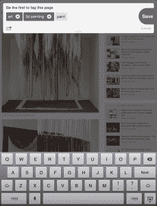

# 在 Skype 联合创始人 Janus Friis 的支持下，Futureful 在 iPad 上推出更智能的网上冲浪 TechCrunch

> 原文：<https://web.archive.org/web/https://techcrunch.com/2013/01/23/backed-by-skype-co-founder-janus-friis-futureful-launches-on-the-ipad-for-smarter-web-surfing/>

如果你是一个内容发现老手的粉丝，或者对 T2 的新外观不太感冒，那么你可能会喜欢芬兰赫尔辛基的一家新公司，名为未来的 T4。作为芬兰最大的种子期创业加速器 [Startup Sauna](https://web.archive.org/web/20221208231042/http://startupsauna.com/en/) 的产品，Futureful 在过去三年里悄悄建立了一个预测发现引擎，联合创始人马尔科·安德森称其为“部分玩具，部分工具”，并试图为用户提供一个个人过滤器来过滤网络上的各种内容。

在 Skype(和 Kazaa)联合创始人贾纳斯·弗里斯(Janus Friis)的支持(和指导)下，Futureful 今天正式推出其 iPad 应用程序，这是一个为你周围流动的所有数字信息提供的个人和预测界面。虽然这听起来有点不切实际，但“未来感”很难用几句话来概括。

然而，像 StumbleUpon 一样，该应用程序避开了传统的网络浏览器和熟悉的搜索机制，并在应用程序中定制了自己的混合浏览器，因为它相信有比普通的网络浏览体验更多的发现。所以，不要期望能够输入你的标准网址，这些都找不到。因为搜索本质上要求用户知道他或她在找什么，它不允许 Futureful 正在寻找的那种偶然发现(但相关)的信息发现。

就这一点而言，Futureful 既不是社交网络，也不是新闻阅读器，所以不要指望 Pinterest 或 Flipboard。相反，该应用程序旨在用于查找各种各样的数字内容，新闻是这种发现体验的一部分，Futureful 没有创建自己的社交网络，而是挖掘社交数据来帮助为你提供相关信息，但同样，这只是它考虑的许多信号之一，正如安德森所说，这家初创公司选择了不“仅通过社交关系来定义人们”。

 相反，Futureful 会分析它认为与你相关的其他用户的模式和趋势，寻找那些与你有相似兴趣或行为的人，并相应地提供内容。该应用程序植根于人工智能、语义标记和机器学习，因此它可以边学边用。你(和其他用户)浏览和发现的越多，它的建议就变得越相关。

当用户阅读 Futureful 的内容时，该应用程序会在屏幕顶部显示主题标签，将用户带到相关链接的页面，等等。这建立了一种动态，用户可以继续通过智能相关的链接链(或树)，但不要太智能，因为应用程序希望保持惊喜和相关性的高质量组合。

这意味着，虽然 Futureful 可以成为发现一些互联网宝石的好方法，但它也有可能成为一个巨大的时间接收器。人们很容易迷失在这个偶然发现的海洋中。毕竟，Futureful 确信它不会给你看两次相同的内容，所以如果你喜欢某样东西，你最好记下来。

但不用担心，该应用程序允许你“收藏”你喜欢的东西，然后这些东西会被添加到你的“收藏”页面(在屏幕的底部中心)，允许你记录你正在挖掘的所有东西。用户还可以添加标签来保存页面以供以后参考，从而使服务对其他人来说稍微好一点。想要更多内容？向下滑动。

截至目前，Futureful 仅支持 iPad，尽管该团队希望在所有移动平台上运行，从 Android 开始，他们希望在今年晚些时候开发并推出 Android。创始人尚未决定商业模式，但安德森表示，一些公司希望获得其技术的许可，以帮助推动应用程序、网站等领域的预测个性化，他们对此很感兴趣。虽然这为 Futureful 带来了潜在的未来收入流，但该团队计划在没有许可的情况下尽可能多地进行合作，并希望在 2013 年的某个时候推出一个 API。

至于它打算如何维持运营？这个八人团队从 Janus Friis 和 family and friends 那里筹集了 150 万美元的种子资金，安德森表示，“很多美国风险投资者对进行大规模 A 轮投资感兴趣”，现在它计划更加积极地关注这个项目，因为未来是应用商店中的爱情。

“Stumbleupon 对意外收获很有帮助。“谷歌在相关性方面非常出色，”Futureful 的联合创始人马尔科·安德森告诉我们。“但我们认为中间的空间才是神奇之处。我知道这听起来很简单，但它需要全新的人工智能和用户界面，这就是我们想要提供的。”

更多信息，请点击此处在 App Store 中寻找 Futureful，或者查看下面的搞笑介绍视频，尽量不要发作:

[vimeo 57917135 w=640&h=380]