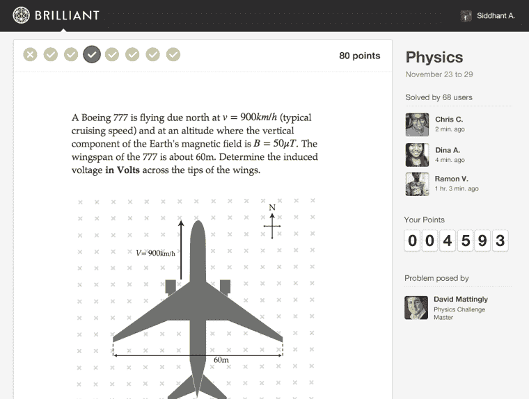

# 在社交+资本的支持下，Brilliant.org 正在寻找并挑战世界上最聪明的技术人才 TechCrunch

> 原文：<https://web.archive.org/web/https://techcrunch.com/2013/08/11/backed-by-social-captial-brilliant-org-is-finding-and-challenging-the-brightest-technical-talent-in-the-world/>

Pharrell Wu 一岁开始做数学，三岁开始炒股。生活在菲律宾的吴(音译)厌倦了学校的数学课程，开始在父母家中的一台电脑上搜索数学难题。他遇到了[Brilliant.org](https://web.archive.org/web/20221101065730/http://brilliant.org/)，这是一个最近推出的在线社区，挑战并汇集技术头脑来解决数学和分析问题，并开始完成问题。

Brilliant 的创始人 Sue Khim 看到吴在一些数学考试中击败了大学生，并立即将这个年轻的男孩与密歇根大学的一名数学教授配对，进行私人辅导，学习本科水平的线性代数。据他现在的导师说，吴已经达到了数学专业优秀本科生的水平，而且考试成绩比他几乎所有的学生都要好。

Khim 解释说，世界各地都有像吴这样的优秀技术人才，互联网将他们聚集在一起。Brilliant.org 希望成为一个社区，让这些人(年轻人和老年人)聚集在一起挑战自我，找到志同道合的人才，并找到使用他们技能的机会。

Khim 说，Brilliant 的灵感来自于这样一种认识，即当前寻找将成为科学、医学和技术领域领导者的技术人才的模式被打破了。在许多国家，高中生被鼓励集中精力为一个国家考试学习，这将决定他们去哪里上大学。在大学里，衡量这些学生的标准是死记硬背的技能，而这些技能与他们将如何运用技能解决实际问题无关。

她表示:“在培养优等生的智力技能和他们为了在这个体系中取得成功而实际上必须花费的时间之间，存在着不匹配。”。但不幸的是，她解释道，如果你在这个系统中不成功，就没有办法被注意到。

因此，希姆决定创造一个地方，让这些学生能够成功，挑战自我，实现他们的真正潜力。她召集了许多数学教授、科学家和其他技术人员在网站上解决难题。辉煌功能每周奥林匹克式的挑战，提供严格的数学和物理问题集。用户不仅可以解决问题，还可以分享他们的解决方案以及他们解决问题的过程。

今年 3 月，Khim 在[发布节](https://web.archive.org/web/20221101065730/http://festival.launch.co/)上展示了 Brilliant，引起了投资人和社交+资本创始人 [Chamath Palihapitiya](https://web.archive.org/web/20221101065730/http://www.crunchbase.com/person/chamath-palihapitiya) 的注意。Palihapitiya 一直特别关注投资于教育方面的一些中断，并在 Khim 试图做的事情中看到了巨大的潜力。

尽管该网站当时只有几千名用户，但 Palihapitiya 告诉 Khim，他相信 Brilliant 有一天会有数百万用户。他与 Kapor Capital、500 Startups、Learn Capital、RTA Capital 和海德公园天使投资公司(Hyde Park Angels)一起，启动了 Brilliant 来帮助扩大网站规模。不到一年后，Brilliant 已经拥有来自 135 个国家的 10 万名用户，并且每两个月用户数量就会翻一番。Khim 认为该网站可能在一年内达到 100 万用户。用户范围从 13 岁到老年人。

当学生到达网站时，他或她参加一个简短的诊断考试，该考试将指定数学或问题解决技能的水平(1-5)。每周，学生将获得针对他们的能力定制的问题集，这些问题集比他们在学校遇到的问题更具挑战性和趣味性。学生有三次机会获得问题集中每个问题的正确答案。当他们解决问题时，他们会得到分数，这些分数可以用来换取学术机会和其他奖励。如果学生在目前的水平上连续两周表现良好，Brilliant 将把他们提升到下一个水平。

正如希姆解释的那样，起初，Brilliant 开始雇佣专业人员开发具有挑战性的物理和数学问题，但现在，越来越多的内容是由用户生成的，教授和技术人员实际上很喜欢创造问题，看看是否有人能解决这些问题。例如，Brilliant 目前正在举办一个名为[饥饿游戏](https://web.archive.org/web/20221101065730/https://brilliant.org/competitions/hunger-games/)的理论编程锦标赛。用户编写一个算法与其他算法决一死战(当然是在线)。

竞赛方面，有很多解题网站和竞赛(解题艺术、欧拉项目、TopCoder、Kaggle、IXL、北京在线评委等在线评委网站等。)，但是没有很多非常活跃的解决问题的社区。Reddit、Quora、Stack Overflow 和其他基于论坛的网站都有数学/科学社区，但这些网站是为了不同的目的而建立的。

希姆认为她最接近的类似物是离线数学俱乐部、竞赛和科学俱乐部。

虽然这个网站还很年轻，但 Khim 和 Palihapitiya 已经有了自己的商业模式。最终，Brilliant 将把这些优秀的技术人才与大学(正如他们已经与吴一起做的那样)以及需要这些人才的公司和组织联系起来。希姆解释说，对数学、科学和工程人才的需求从来没有像现在这样大，她相信他们可以围绕这一点培养一批观众。“这不仅仅是另一个求职板，”她说。“这将是通向机遇的管道。”

希姆有所发现。除了吴的故事之外，还有很多类似的人，光辉正在帮助他们寻找并提供机会给那些可能被忽视的有才华的人。正如她所说，这些人将为我们的世界解决金融、科学和医学领域的重大问题。

至于吴，如果他没有被 Brilliant，Khim 和她的团队注意到，他的旅程将会怎样还不清楚。他现在每周在谷歌上和教授一起做研究生水平的数学工作，并计划几年后来美国上大学。他雄心勃勃，想成为一名投资银行家，但谁知道哪个研究机构、大学或科技巨头可能会抢先高盛一步。

【YouTube = http://www . YouTube . com/watch？v = encqyz 8 oz 8 q & w = 640 & h = 480]