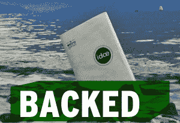

# 支持还是疲惫:通过众筹阅读和写作 TechCrunch

> 原文：<https://web.archive.org/web/https://techcrunch.com/2013/05/18/backed-or-whacked-3/>

**编者按:** *罗斯·鲁宾是[十字线研究](https://web.archive.org/web/20221007031124/http://www.reticleresearch.com/)的首席分析师，并在[科技进展](https://web.archive.org/web/20221007031124/http://www.techspressive.com/)发表博客。每个专栏都关注那些已经达到或未达到融资目标的众筹产品。在推特上关注他 [@rossrubin](https://web.archive.org/web/20221007031124/https://twitter.com/rossrubin) 。*

作者和观众之间古老而又神圣的纽带，阅读和写作已经变成了另外两项任务，以及我们在许多数字设备上做的许多其他事情——看视频、听音乐、玩游戏，以及除了使用 Facebook Home 之外的任何事情。尽管如此，对一些人来说，笔和纸之间的亲密接触比世界上所有设备的所有电子动力都无法再现的更具魔力。对他们来说，三个欧洲众筹项目推出了一系列产品，以改善模拟文档创建的两个端点。

**疲惫不堪:[懒汉](https://web.archive.org/web/20221007031124/http://www.kickstarter.com/projects/lazypete/lazypete-the-one-hand-book-reader?ref=category)。**啊！听好了，你们这些坏血病的狗，当我告诉你们懒惰的皮特的传说时，一个沉迷于他的浪漫小说的海盗，他没有看到一条大白鲨从海洋中跃出，只留下他一只手。为了向懒惰的皮特致敬，Philip Musche 把他的单手阅读装置命名为“阅读装置”,它实际上是把一个可以保持书页打开的书架放在一个结实的手柄上。尽管展示了几乎足够覆盖七个海洋的颜色的阅读辅助工具，Musche 仍未能获得足够的众筹战利品，该活动最终只获得了所需的 30，000 英镑宝藏中的 533 英镑。

**背靠:[科](https://web.archive.org/web/20221007031124/http://www.kickstarter.com/projects/1054394377/idae-the-booklet-for-extreme-situations?ref=category)。**go pro 之于大多数数码相机，Idae 之于大多数袖珍期刊，甚至耐用的[野外笔记](https://web.archive.org/web/20221007031124/http://fieldnotesbrand.com/)。这款防水、防撕裂的笔记本正是你在下次潜水途中需要为你的购物清单添加重要物品的时候所需要的东西，也是你的[费希尔太空笔](https://web.archive.org/web/20221007031124/http://www.spacepen.com/)的完美搭配。如果你需要更多的证据来证明它有多极端，它有一个洞可以放一个铁锁。

也就是说，火会把它和你受启发写在斜坡上的俳句一起消耗掉。如果你不打算无限期地保存你的笔记，笔记本可以回收。这本 32 页的《思想保存者》在米兰开发，上个月以 20 至 30 美元(取决于封面颜色)的价格运送给支持者，它实现了 7200 美元的融资目标，还剩下几百美元，但你会想到这样一个硬汉会有那种令人紧张的兴奋。

**力挺:[流星握](https://web.archive.org/web/20221007031124/http://www.kickstarter.com/projects/409266252/the-meteor-grip-changing-the-writing-experience-fo?ref=category)。**这支铅笔已经足够细，可以作为比较高科技电子产品的基准。虽然对许多人来说很舒服，至少在短时间内，但对一些人来说可能很难掌握。2011 年 12 月，英国庞特弗拉克特的 Jai Dickerson Pierce 从他的纹身艺术家伴侣 Zo 的手部疼痛中获得灵感，开发出了 Meteor Grip。很少提供关于使用什么材料来制造把手的细节。相反，其独特性的关键是可以在右手和左手版本。正如宣传页所用的双重否定声称，“没有其他制造商生产出不灵巧的符合人体工程学的手柄。”

也就是说，该活动并没有覆盖一系列用途，声称该产品作为一种新奇的礼物是有用的，同时还宣称它“永远改变了写作体验。”虽然对小孩来说还没有改变，但是一个潜在的陨石把手现在还在计划中。还有三周多一点的时间，流星抓地力已经收集了大约其卑微的 875 目标的四分之一。七英镑将把你对天文学的热爱与对薄书写工具的仇恨结合起来，十英镑可以为你以及你生活中的抽筋纹身师尽快在这个月得到一个。