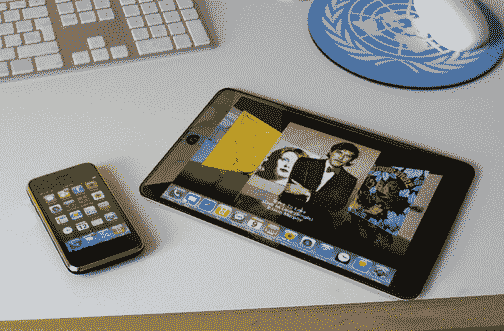

# 下周的苹果活动最终会给 iPhone 带来后台应用吗？TechCrunch

> 原文：<https://web.archive.org/web/https://techcrunch.com/2010/01/19/background-apps-iphone-tablet/>

今天早上，在对这款神秘的平板电脑进行了数月的疯狂猜测之后，苹果官方邀请了数十家媒体参加将于 1 月 27 日举行的特别媒体活动。根据大多数报道，平板电脑的首次亮相似乎是板上钉钉的事情，但也有一些次要的公告也将是巨大的——特别是传言我们可能也会看到 iPhone 4.0 的发布。今天下午，福克斯新闻频道证实，我们将首次看到苹果广受欢迎的移动操作系统的最新版本。如果是这样的话，我们也很有可能会看到一个*非常*重要的新功能的推出:后台应用。

重要的事情先来。虽然福克斯新闻频道文章的标题是“苹果平板电脑，iPhone 4 确定于 1 月 27 日发布”，但文章的正文后来说，苹果“很可能”将发布这两款产品(以及更新的 iLife 套件)，并指出苹果以在最后一秒突然从发布会上删除功能或产品而闻名——这些都没有让消息听起来完全具体。也就是说，有很多理由可以解释为什么 iPhone 4.0 会出现在平板电脑旁边，以及为什么它会带来后台应用程序。

早在去年五月我们就已经讨论过平板电脑和 iPhone OS 之间可能的联系。通过 iPhone OS，苹果公司采用了 Mac OS X，并对其进行了精简，使其成为一个紧凑而强大的移动操作系统。平板电脑几乎肯定会比 iPhone 马力更大，但它仍然会受益于移动操作系统的省电和节省空间的特性(尽管是一个修改版)。不到一周前，我们的怀疑得到了进一步的支持，当时我们看到报道称，最新发布的 iPhone OS 实际上被推迟了，因为它的一些代码暗示了这款未发布的平板设备。鉴于这些联系，iPhone 4.0 操作系统与平板电脑一起亮相是合乎逻辑的。

但平板电脑操作系统需要带来一些新功能。首先，它可能需要允许用户同时运行多个应用程序。大多数人并不特别在乎他们的 iPhones 不能做到这一点，因为屏幕空间非常有限，他们不把设备视为掌上电脑(即使它是一台)。但平板电脑不会这样——鉴于其更大的屏幕，用户将期待更多的功能，无法运行多个应用程序将很快变得令人沮丧。考虑到这一点，如果苹果已经建立了在平板电脑上运行后台应用程序的范式，那么最终将其引入 iPhone 也是有意义的。

与其他移动操作系统相比，iPhone 目前缺乏后台应用程序是其最明显的弱点之一，尤其是 Android 和 Palm 的 WebOS。苹果此前保留该功能的原因显而易见:运行多个应用程序会更快地耗尽设备本已紧张的电池，迫使用户管理哪些应用程序处于打开状态会增加额外的复杂性。当时这是正确的选择，但现在是时候改变了。

许多开发人员的应用程序已经因为无法在后台运行而受阻。消息客户端必须依赖 iPhone 的推送通知，一次只能显示一个提醒。一旦你试图在手机上做其他事情，音乐播放器(除了内置的 iPod 应用程序)就会关闭。基于位置的应用程序必须几乎完全依赖由 Foursquare 推广的“签到”模式，因为它们没有办法被动监控你的位置。消费者可能还没有对这些限制感到沮丧，但他们羡慕地看着他们的 Android 朋友在后台运行 Pandora 和 Skype 或 Meebo 只是时间问题。

苹果也知道这一点。早在去年五月，我们[就听说](https://web.archive.org/web/20221209050822/http://www.beta.techcrunch.com/2009/05/15/apple-is-indeed-talking-about-opening-iphone-background-tasks/)苹果正在认真讨论如何实现后台应用程序。就像复制和粘贴一样(iPhone 用户不得不等待数年)，苹果显然在第一次就把事情做好。现在，随着平板电脑的即将发布，苹果可能终于找到了解决方案。如果福克斯新闻频道的报告是正确的，这可能会在下周揭晓。但是，即使 iPhone 4.0 几个月后才发布，后台应用程序也很有可能会随之出现。

*图片通过 [Gizmodo](https://web.archive.org/web/20221209050822/http://gizmodo.com/5336670/photoshop-contest-put-an-apple-tablet-in-your-life) 获得。不，这不是真的。*