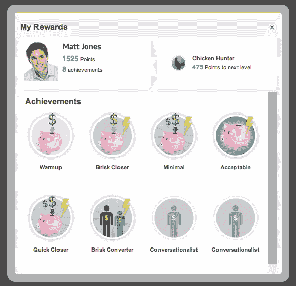

# Badgeville 游戏化平台来到 Salesforce.com TechCrunch

> 原文：<https://web.archive.org/web/https://techcrunch.com/2012/09/18/badgeville-gamification-platform-comes-to-salesforce-com/>

# Badgeville 游戏化平台来到 Salesforce.com

Badgeville 的游戏化服务已经在 T2 的 Salesforce.com 的 AppExchange 上推出。这项新服务将允许人们在 Salesforce.com 生态系统的任何应用程序上分发徽章。

对于 Badgeville 的联合创始人 Kris Duggan 来说，这个消息具有一定的意义。两年前，该公司在 TechCrunch Disrupt 旧金山站推出了产品。当时是达根和他的联合创始人韦奇·马丁。公司已经筹集了 30 万美元，公司有六个客户。如今，Badgeville 拥有 4000 万美元的风险投资、80 名全职员工、三个办公室和 200 名客户，其中包括戴尔、Barnes & Noble 和甲骨文。

从那以后，游戏化开始发展。达根说，“游戏化”搜索显示 650 万个结果。两年前，有几千个结果。Badgeville 已经发展成为一个平台，公司正在利用它为医疗保健和其他市场推出游戏化服务。通过 Salesforce.com，Badgeville 正在包装其服务，以提供自己的平台。

Duggan 认为这项服务是通过 API 将 Badgeville 平台引入不同应用的一种方式。例如，开发者现在可以使用这项服务集成到现有的 Salesforce.com 社交应用中，如 Radian 6 或 Ripple。

目标之一是让 Badgeville 对销售文化产生影响。达根的职业生涯始于销售。正如他所指出的，销售人员经常被他们的老板督促做得更好。这里的要点是提供一种方法，给销售经理一种方法，给他们的销售人员一根胡萝卜。

Badgeville 在与公司的市场竞争中表现出色，如 [Bunchball](https://web.archive.org/web/20221225093854/http://www.crunchbase.com/company/bunchball "Bunchball") 、 [Omniture](https://web.archive.org/web/20221225093854/http://www.crunchbase.com/company/omniture "Omniture") 和 [Prooflink](https://web.archive.org/web/20221225093854/http://www.crunchbase.com/company/prooflink "Prooflink") 。它更像是一个平台。这一消息代表了技术向应用平台的转变。这一变化将在该公司的下一次发展中发挥作用，并测试它是否能把游戏化带到更广阔的应用领域。