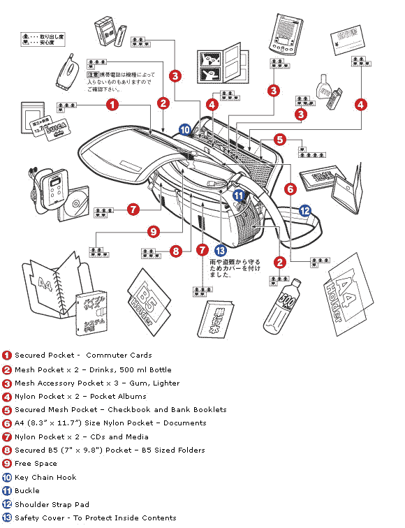

# 包包周回顾:游牧 WR-08 Wise-Walker 单肩包 

> 原文：<https://web.archive.org/web/http://techcrunch.com/2011/11/16/bag-week-review-nomadic-wr-08-wise-walker-shoulder-bag/>

# 包包周回顾:游牧 WR-08 智者-沃克肩包

接下来，在今年的[手袋周](https://web.archive.org/web/20230204132814/https://techcrunch.com/tag/bag-week-2011/)中，我们将推出来自游牧民族的名字奇怪但设计有趣的 Wise-Walker。这种日本进口商品是一种前期业务，也是一种内部聚会。

## 游牧 WR-08 智者-沃克单肩包

**型号:**单肩包

**尺寸:** 15 英寸 x 12 英寸 x 5 英寸

**口袋:**前盖口袋，拉链笔记本隔层(最大 13 英寸), 2 个 velcro 口袋，1 个主拉链口袋，侧瓶架

**特点:** Velcro 顶部翻盖，内部色彩亮丽

**建议更新项目:** $73

[产品页面](https://web.archive.org/web/20230204132814/http://www.jetpens.com/Nomadic-WR-08-Wise-Walker-A4-Shoulder-Bag-Black/pd/6834)

* * *

**风格**
游牧的 WR-08 Wise-Walker 就像一场惊喜的生日派对。前一分钟，你正走上楼梯，走向你那单调、黑暗的房子，下一分钟，你就享受到了由你所爱的人拿着的一把可爱的亮橙色气球。然后你得到蛋糕。看，和 party 一样，Wise-Walker 是一款标准的、相当单调的单肩包，有黑色尼龙外壳(也有灰色和藏青色)和亮橙色衬里。它是日本制造的，这是另一个优点。遗憾的是，包里没有蛋糕。

就风格而言，大部分的魔法都发生在内部。除了外面可爱的名字标签外，很难看出这款包是真正的进口货，也没有什么特别值得推荐的地方。然而，实际上，这是一个不小的发现。

**实用**
这个包出奇的宽敞。诚然，它看起来很小，但大多数口袋都足够大，可以存放任意数量的电缆、鼠标和平板电脑。我已经能够把这个包作为旅行的伴侣，甚至在一次会议后把几个巨大的设备盒子放进包里。如果你正在寻找一个旅行包或一个办公室包，可以用来放小型笔记本电脑、平板电脑或者一些笔，你真的不会错。我也可以把它当作旅行包，把几件衬衫、一件夹克和一些化妆品塞进主口袋。

智者行者也相当结实和有弹性。一个警告:前面的 velcro 关闭有点小，以保持包完全关闭，当包没有关闭，前面的 velcro ed 口袋将打开，露出你的一些项目。别塞太满就好了。

**给谁的？**
喜欢日本风格和设计的人会从这个包里得到一种享受。它非常小——它的设计适合 A4 大小的笔记本电脑——但对于 Macbook Air、平板电脑和其他一些小垃圾来说，它已经足够大了。按照美国的标准，水瓶是很小的，但是除了前面的 velcro 口袋，其余的口袋都拉上了拉链，很安全。我个人非常喜欢亮橙色的内部材料，而且价格和你能找到的其他好的笔记本电脑包一样。

同样，它有点小，所以如果你是一个重型笔记本电脑用户，请随意寻找稍微大一点的东西。

* * *

[点击此处查看 2001 年手袋周的其他内容。](https://web.archive.org/web/20230204132814/https://techcrunch.com/tag/bag-week-2011/)