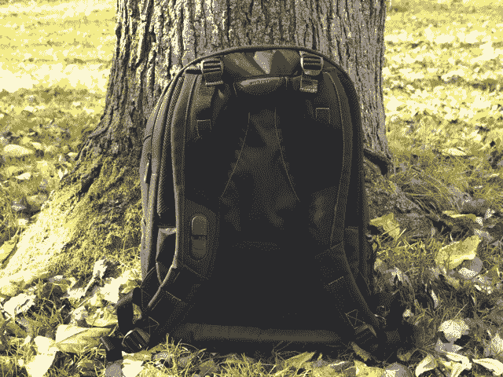

# 包包周回顾:塔格斯云杉生态智能 

> 原文：<https://web.archive.org/web/https://techcrunch.com/2011/11/15/bag-week-review-the-targus-spruce-ecosmart/>

当我加入 TechCrunch(以及美国在线)时，我发现自己在公司发放的袋子里游泳。标准版 MacBook Pro 配有一个巨大的 Targus beater 单肩包，AOL 认为送我一个印有巨大紫色 AOL 标志的 Ogio 背包是合适的。

几天后，我把它们都塞进了壁橱。

取而代之的是，我每天都带着塔格斯云杉 EcoSmart 到处逛。这不是你在包包周可能看到的最贵、也不是最时尚的包包，但它是一款结实、舒适的日用包，可以携带你的大部分日常必需品，不会让你后悔。

## 塔古斯云杉生态智能

**类型:**背包
**尺寸:** 13″ x 18.75″ x 8.25″
**口袋:**笔记本电脑隔层(最大可达 15.6″)，主货舱，副货舱，3 个拉链口袋
**特点:**轻质网状肩带，环保材料
**MSRP:**
[商品页](https://web.archive.org/web/20221207094740/http://www.targus.com/us/productdetail.aspx?sku=TBB013US)

* * *

如果你看不出名字，云杉生态智能车的设计考虑了环境因素。不，如果你把它扔进垃圾填埋场，它不会生物降解——相反，这种袋子的聚酯材料是由回收塑料瓶制成的。

说到云杉的身体，乍一看它很不起眼，但仔细看看就会发现一些有趣的小装饰，比如沿着前面的一系列硬橡胶凸起。虽然它们实际上为包的正面增添了一点个性，但它们也意味着承受你随身携带包时带来的冲击。

包的所有缝线都是绿色的，每个拉链上的小植物标志也是绿色的。真正吸引你眼球的是包包的森林绿色衬里。这似乎是一个愚蠢的方式来宣传这种袋子的环保功能，但当试图从袋子底部挖出一个很难看到的东西时，它变得非常有用。

这款包的肩带很厚，但由轻质网眼制成，可以防止负荷过多地挤压你的肩膀。右边的表带还带有一个小塑料旋钮，真正挑剔的人可以用它来缠绕耳机线。同样的泡沫网战略性地放置在你的下背部和肩膀附近，这使整个事情感觉非常轻松。

厚度超过 8 英寸，云杉似乎不会有太大的问题来适应你的东西，但它比你想象的更紧。这是因为 Targus 觉得有必要将东西划分得太多了——笔记本电脑放在一个袖子里，占据了一个隔间的大部分空间，而前面的隔间是你大多数东西的去处。另一个较小的隔间位于前面，有放笔、身份证和其他你可能想扔进去的杂物的口袋。

我通常的装载包括前面提到的 15 英寸 MacBook Pro、一台 iPad、几台笔记本、我的松下 GF2 和几个额外的镜头，所有这些都非常适合放在里面。这个包非常适合一日游(即使是那些需要跑来跑去的)，但云杉肯定不会是你周末外出的首选包。

这是给谁的？
抱树者，携带许多小东西而不是几个大东西的人，狂热的一日游者。

**我想要吗？**

那要看情况——价格当然是合适的(尤其是如果你稍微逛逛的话)，但是你必须将就一些奇怪尺寸的隔层。尽管如此，对于那些没有坚定不移地需要随身携带一生的人来说，这是一个非常舒适的背包。

[幻灯片]