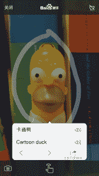

# 百度翻译应用有一个很酷的图像识别工具 TechCrunch

> 原文：<https://web.archive.org/web/https://techcrunch.com/2014/01/20/baidu-translate-app-features-a-cool-image-recognition-feature/>

以打造中国顶级互联网搜索引擎而闻名的百度，刚刚为 iOS 提供了其[翻译应用。iPhone 和](https://web.archive.org/web/20230130013327/https://itunes.apple.com/us/app/bai-du-fan-yi-baidu-translate/id605670941?mt=8) [Android 版本](https://web.archive.org/web/20230130013327/https://play.google.com/store/apps/details?id=com.baidu.baidutranslate&hl=en)的描述是中文的(在商店里搜索“百度翻译”)，它的介绍/说明屏幕也是中文的，但不用担心——该应用的用户界面大部分是英文的。

百度翻译的一个关键功能是英语、普通话和粤语的语音翻译，我发现它非常准确。这是对其他语音翻译应用的一个很好的免费替代，大多数语音翻译应用只提供中文支持作为应用内购买。但这还不是最酷的部分。我最喜欢百度翻译的图像识别功能，它可以让你给某样东西拍照，然后把它圈起来。然后，该应用程序会尝试识别该物体，并用中文和英文告诉你它是什么。

图像翻译的准确性目前是断断续续的，经常出现令人捧腹的错误。它正确地识别出了我的小猫的一张照片(尽管它称她为挪威森林猫，而实际上她是一只台湾野猫)、一个 Xbox 360 控制器(但不是按品牌——百度翻译只是用英语将其描述为“无线手柄”)、一个锡发条玩具、一个马克杯、一支笔和一把椅子。但该应用认为我的荷马·辛普森 Pez 分配器是一只“卡通鸭子”(公平地说，他看起来确实像一只黄色的橡胶鸭子)，并将哈利·波特的图像描述为“红烧鲤鱼头”。

抛开缺点不谈，百度翻译是我用翻译 app 过得最好的一次(不敢相信我刚打了那句话)。[谷歌眼镜](https://web.archive.org/web/20230130013327/https://play.google.com/store/apps/details?id=com.google.android.apps.unveil&hl=en)也可以用于翻译，但用另一种语言获得结果的过程更复杂，而且它经常无法识别图像(甚至试图告诉你这是什么，就像百度翻译一样)。

这款应用的摄像头可以让你在同一个屏幕上切换图像识别和光学字符识别功能。我发现后者的准确性也相差很大，但大多数 OCR 应用程序都是如此。

百度经常被称为“中国的谷歌”，它雇佣了许多有才华的数据科学家，所以我预计随着更多人使用它，这款应用的图像识别功能会迅速改善。百度国际交流总监郭怡广(Kaiser Kuo)告诉我，该公司专注于人工智能的深度学习研究所(主要位于北京，有一个[硅谷实验室](https://web.archive.org/web/20230130013327/http://www.wired.com/wiredenterprise/2013/04/baidu-research-lab/))将继续致力于其所有功能。

“我们还没有确定未来迭代的发布日期，但我们将继续改进它的各个方面:OCR、语音识别，当然还有图像识别的准确性。图像识别当然是非常棘手的:你并不总是能从平面图像中知道一个物体的大小，三维物体在光照、阴影、角度等方面的变化将在未来一段时间内使这一点变得具有挑战性，但我们对迄今为止所做的一切感到非常自豪，”Kuo 在一封电子邮件中说。

这意味着会有更少有趣的错误，但希望更新会使百度翻译成为过去几年发布的所有伟大的语言学习和翻译应用程序的一个越来越棒的补充。