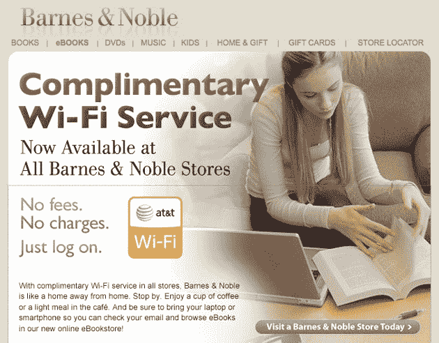

# Barnes and Noble 现在有免费 Wi-Fi 

> 原文：<https://web.archive.org/web/https://techcrunch.com/2009/07/31/barnes-and-noble-now-has-free-wi-fi/>

# Barnes and Noble 现在有免费无线网络

巴诺书店现在有免费 Wi-Fi。大坏书店连锁店今天刚刚打开了免费服务的开关，这是由 AT & T 提供的。

在他的书[我恨你的胆量](https://web.archive.org/web/20221004103026/http://www.amazon.com/Hate-Your-Guts-Jim-Norton/dp/1416587861/ref=sr_1_1?ie=UTF8&qid=1249054141&sr=8-1)中，吉姆·诺顿说他希望星巴克的无线网络接入每小时收费 300 美元，大概是为了清除那些破坏他选择饮料的能力的白吃白喝的人。

我想就这样吧。抱歉打扰你。