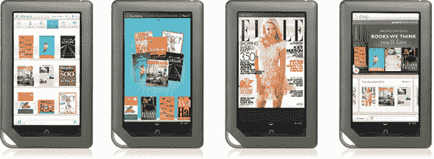

# Barnes & Noble 发布 Nook Color，请表现出惊讶 

> 原文：<https://web.archive.org/web/https://techcrunch.com/2010/10/26/barnes-noble-reveals-a-color-nook-please-act-surprised/>

# Barnes & Noble 推出 Nook Color，请表现出惊讶

 嗯，嗯。网络谣言工厂又赢了。几周前就有消息称 B & N 将推出一款彩色 Nook，果然，书商真的这么做了。

Android 支持第二代 Nook，它使用 7 英寸的彩色液晶显示器来显示内容。由于 Android 在里面，它比电子书阅读器多一点，比平板电脑少一点。有像脸书和推特这样的社交网络应用，以及显示视频和标准电子书内容的能力。听起来有点像其他设备，不是吗？

B&N 将其作为一个全新的产品类别进行营销。他们想把阅读电子书变成一种社交活动，并利用标准的社交网络。这项被称为 Nook Friends 的功能允许用户与他们的网友分享语录甚至书籍。但是 B&N 并不仅仅是为了这些功能才使用 Android 的。Nook Color 有一系列应用程序，包括 Pandora、游戏、访问谷歌和维基百科、联系人管理器等等。甚至还有一款功能齐全的杂志阅读器，可能会被大肆宣传。

不过，对安卓粉丝来说，这是个坏消息。Nook Color 是所谓的策划体验，这是一种说不存在 Android Marketplace 的奇特方式。

至于硬件，Nook Color 没有任何物理按钮。取而代之的是一个 1024×600 的 7 英寸屏幕，层压以减少传统上与液晶显示器相关的眩光。有一个 MicroSD 卡插槽和无线网络。整个重量为 15.6 盎司，厚度为 0.48 英寸——仅比新款 Kindle 重 5.4 盎司，厚 0.12 英寸。

网络谣言俱乐部也获得了定价权:249.99 美元。这使得它的价格只有 iPad 的一半，但比只有 WiFi 的 Kindle 贵了 100 多美元。好位置？市场将于 11 月 19 日开始决定，届时它将与旧款双屏机型一起上市。