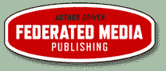

# 巴特尔拒绝了 FM 出版公司 1 亿美元的报价。决定货比三家，寻找更高的价格。

> 原文：<https://web.archive.org/web/https://techcrunch.com/2008/01/24/battelle-turns-down-100-million-offer-for-fm-publishing-decides-to-shop-around-for-a-higher-price/>

# 巴特尔拒绝了 FM 出版公司 1 亿美元的报价。决定货比三家，寻找更高的价格。

 昨天，有消息开始流传，[联合媒体出版](https://web.archive.org/web/20230213041249/http://www.federatedmedia.net/)雇佣了 [Savvian](https://web.archive.org/web/20230213041249/http://www.crunchbase.com/financial-organization/savvian) ，一家旧金山的小型投资银行，在博客广告网络上向潜在买家进行采购。这一行动是在几个投资者接触了 FM Publishing 之后采取的。据我们所知，一位投资者提出以 1 亿美元收购整个公司，但被 FM Publishing 拒绝了。

FM 的创始人兼首席执行官约翰·巴特利以前也走过这条路。当他在互联网繁荣时期管理行业标准时，至少有三家公司向他发出收购这家新兴媒体公司的坚定要约，最终出价 7.5 亿美元。巴特尔持有该公司的少量股份，强烈敦促控股股东、IDG 董事长帕特·麦戈文接受这笔交易。在[巴特尔自己的叙述中，](https://web.archive.org/web/20230213041249/http://battellemedia.com/archives/003491.php)他回忆道:

> 2000 年一整年，我都在试图说服麦戈文先生让我们把公司卖给一个更有实力的买家，一个相信我们对互联网经济的愿景的买家。他拒绝了，并敦促我们公开。正是这种冲突导致了我们的分歧，并在一定程度上导致了我们的灭亡。我向麦戈文提出了三个非常真实的报价，他拒绝了三次，并告诉我，相反，我们会让公司上市，或者至少让潜在买家将价格翻倍。鉴于价格在 2.5 亿至 7.5 亿美元之间，在我看来，这样的回应是荒谬的。但是他拥有大部分股份，他的话才是最重要的。

现在，巴特尔是控股股东，你会认为他会小心，不会再犯同样的错误。他一定很有信心能为 FM 赚到 1 亿多美元。(在发表这篇文章之前，我无法联系到他进行评论)。两年前获得 450 万美元 A 轮投资的其他投资者包括摩根大通合伙人、Omidyar Network、《纽约时报》、米切尔·卡普尔(Mitchell Kapor)、安德鲁·安克尔(Andrew Anker)、迈克·霍默(Mike Homer)和蒂姆·奥莱利(Tim O'Reilly)。

(披露:FM Publishing 控制了许多博客和社交媒体网站上的部分广告库存，包括 TechCrunch。).