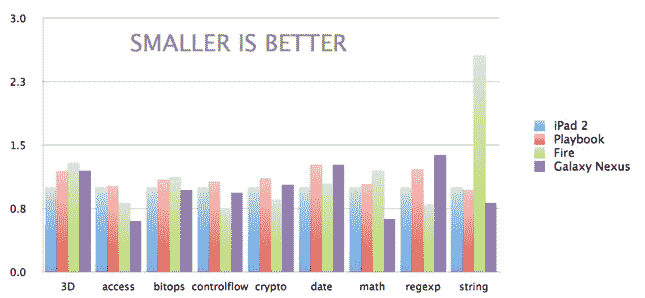
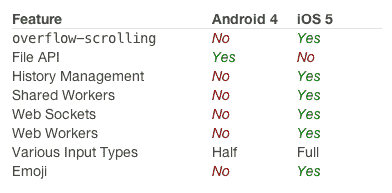

# 浏览器之战:iOS 5 的浏览器仍然(略)优于 Android 的 

> 原文：<https://web.archive.org/web/https://techcrunch.com/2011/12/13/battle-of-the-browsers-ios-5s-browser-is-still-slightly-better-than-androids-says-sencha/>

好了，粉丝们:准备好你们的喷火器。HTML5 框架开发公司 [Sencha](https://web.archive.org/web/20221230062330/http://www.sencha.com/) 刚刚发布了一系列性能工具，用来回答生活中最古怪的问题之一:Android 4 和 iOS 5 谁的浏览器更好？

我想把答案留到最后，但我想标题泄露了它:虽然 Android 4 的浏览器是该平台的“重大进步”，但 iOS 5 的产品最终仍然胜出——但只是差一点点！

Sencha 在四个主要指标上测试了这两种浏览器:渲染精度、渲染性能、HTML5/CSS3 功能支持和 Javascript 性能。

在渲染方面，两种浏览器表现差不多:它们都在行业标准 Acid3 测试的[中获得了完美的分数，尽管它们都有一些小的渲染瑕疵，但它们都足够小，分数不会受到影响。](https://web.archive.org/web/20221230062330/http://en.wikipedia.org/wiki/Acid3)

Sencha 接着测试了每个浏览器的防晒性能。SunSpider 是一系列测试，旨在将 Javascript 推向极限，测试设备在当前(或可能很快)司空见惯的重型任务上的性能。见下面的结果图(注意，他们在这次测试中使用了 iPad 2 而不是 iPhone 4S，因为 CPU 更接近 Galaxy Nexus 的 CPU，出于好奇，还加入了 Kindle Fire 和 Playbook):

(另请注意:小节越小=时间越短=性能越好)

除了一个奇怪的(但大多无关)Kindle Fire 在字符串性能下的异常值，所有设备的性能…都差不多。虽然每个设备都有各自的亮点和弱点，但我们在这里看到的性能差异是以*毫秒*来衡量的。

最后，Sencha 一头扎进了具体的 HTML5 功能，这最终成为唯一一个有明确赢家的测试。虽然这两款设备都提供了相当令人印象深刻的 HTML5 军械库，但 iOS 5 在一些值得注意的地方比 Android 有优势:

其中，最重要的标志是 [Web Sockets](https://web.archive.org/web/20221230062330/http://dev.w3.org/html5/websockets/) 和[Web Workers](https://web.archive.org/web/20221230062330/http://dev.w3.org/html5/workers/)——为了简化起见，它们分别允许网站/设备之间的双向通信(用于实时功能)和多个脚本在设备本地同时运行。更简单地说，它们是让网络应用更像本地应用的重要部分。

Sencha 还深入探讨了一些特定于他们动画工具的指标，你可以在他们的完整报告中找到这些指标。

最后，这些差异非常细微，大多数人(即非开发人员)甚至不会注意到它们。在这一点上，这完全是个人喜好和细微差别的问题。例如，我会选择 iOS 的浏览器而不是 Android 的，几乎完全是因为前者让我只需轻点状态栏就可以跳到页面顶部，而不是无数次的滑动。当一切都同样快如闪电，都是为球座量身定做时，一切都是为了小事。