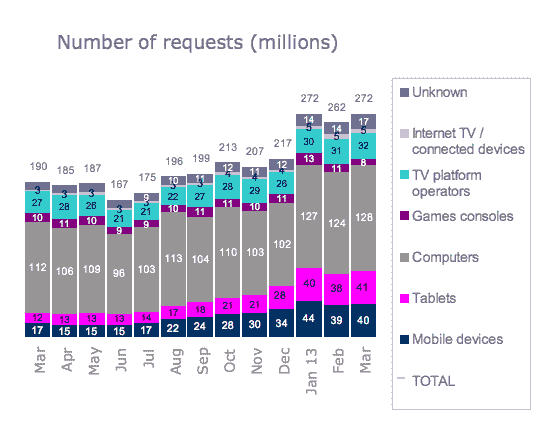

# 在 BBC 的点播 iPlayer 上，平板电脑的使用量首次超过手机:3 月份创下 4100 万次平板电脑请求的记录，而手机只有 4000 万次 TechCrunch

> 原文：<https://web.archive.org/web/https://techcrunch.com/2013/04/19/bbc-iplayer-tablet-usage-overtakes-mobile/>

# 在英国广播公司的点播 iPlayer 上，平板电脑的使用量首次超过了手机:3 月份平板电脑的使用量创下 4100 万次的纪录，而手机只有 4000 万次

今天平板电脑迅速崛起的另一个迹象是:根据本月 BBC 统计数据[显示，上个月平板电脑对 BBC 点播在线电视服务 iPlayer 的使用量首次超过移动设备，平板电脑的节目请求量为 4100 万次，移动设备为 4000 万次。平板电脑上的请求比手机多 20 万个。总体而言，在所有设备类型中，该服务在英国 3 月份收到了 2.72 亿个完整长度的节目请求](https://web.archive.org/web/20221209135057/http://downloads.bbc.co.uk/mediacentre/iplayer/iplayer-performance-mar13.pdf)

按设备类型划分，平板电脑和手机占总请求的 15%。根据下图判断，这两种设备显然正在蚕食主要 iPlayer 访问设备:传统计算机的份额。统计数据显示，手机和平板电脑已经将电脑的使用率从 2012 年 3 月的 59%降至 2013 年 3 月的 47%。同期，平板电脑的份额从 6%增长到 15%，手机从 9%增长到 15%。

【T2

这一发现与更广泛的行业分析一致，即随着人们购买和使用平板电脑和智能手机等替代智能连接设备，PC 出货量正在下降。 [Gartner](https://web.archive.org/web/20221209135057/https://beta.techcrunch.com/2013/04/04/gartner-2012-2017-devices-forecast/) 预测，今年全球将出货近 2 亿台平板电脑，同比增长近 70% ( [IDC](https://web.archive.org/web/20221209135057/https://beta.techcrunch.com/2013/03/27/idc-tablet-growth-2012-2017/) 认为该比例为 78.4%)。而今年个人电脑出货量预计将下降 7.3%。另一个相关数据指向 BBC 的数据，上个月，Adobe 最新的数字指数记录了来自平板电脑的网络流量比例，并首次超过了智能手机。

BBC 的点播电视服务可以让观众在预定节目播出后继续收看，这正是你期望在平板电脑上蓬勃发展的那种应用程序——它既便携，又有足够大的屏幕，可以观看高制作价值的视频内容，而不会影响整体观看体验。BBC 的 iPlayer 数据证实了这一点:平板电脑在电视节目中的使用率远远高于广播内容。

具体来看电视内容，BBC 表示，平板电脑在 3 月份占 iPlayer 节目请求的 19%，而移动设备占 17%。但是它的无线电数据显示平板电脑下降到 4%,而移动设备占 10%。电脑将它们的份额扩大到 68%的广播数据——这表明使用电脑进行多任务处理的人在浏览网页或工作时使用 iPlayer 在后台播放广播。

BBC 的 iPlayer 数据还指出了人们在线消费电视和广播内容的另一个有趣差异——大多数(3 月份为 88%)的电视请求是点播(即追看)请求，而不是直播电视观看。但是对于广播来说，比例几乎相反，83%的广播请求是现场收听。

BBC 的许可费可以解释这种行为的一部分，因为 iPlayer 用户需要支付许可费才能观看直播电视(但不需要支付广播)。但这也表明，iPlayer 人群的电视直播观看率持续下降(这比传统电视观众更年轻，截至 2012 年第四季度，76%的 iPlayer 用户年龄在 55 岁以下)。iPlayer 上的电视直播观看比例在 8 月份确实有所增加(达到 32%)，这可能是由于奥运会的缘故。