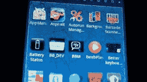

# BBM 安卓应用截图泄露 

> 原文：<https://web.archive.org/web/http://techcrunch.com/2011/10/03/bbm-for-android/>

好吧，我们这里有什么？安卓的 BBM？

新泄露的照片似乎显示 BBM 的测试版运行在一个未指明的(显然是无人关注的)Android 设备上。这些照片的有效性值得怀疑，因为它们是从一个匿名来源发送到 [T3](https://web.archive.org/web/20230205012142/http://www.t3.com/news/bbm-for-android-pictures-leak-ahead-of-official-rollout) 的，这种泄露需要大约五分钟的时间来完成。然而，他们确实为[正在进行的传言](https://web.archive.org/web/20230205012142/http://www.bgr.com/2011/03/03/exclusive-blackberry-messenger-will-launch-on-android-and-ios/)增加了一点分量，该传言称 RIM 计划在包括 Android 和 iOS 在内的外部平台上推出其黑莓信使服务。

撇开图片不谈，让我们先想想这个传说中的计划。

RIM 在留住企业客户方面不会有问题，至少目前是这样。转换平台的成本太高了，RIM 的安全性仍然是不可战胜的。然而，让 RIM 一夜之间(六年)成功的是这样一个事实，不仅是企业，还有青少年和年轻人都在挖掘黑莓。简而言之，这可以归结为信息传递。

 如果说黑莓有一件事对普通大众来说做得最好，那就是信息传递。即使有了 iPhone，BBM 也一直是我羡慕的黑莓独有的小功能。但是如果 BBM 可以在 iPhone 和 Android 上下载——请注意，是免费下载——那么 RIM 将一无所获。

Android 市场份额领先，iOS 紧随其后。根据数据显示，我们不会看到 Android 忠实用户或苹果粉丝在短期内大批离开。另一方面，黑莓操作系统和黑莓手机的销量正在下滑。人们已经弃船而去，去寻找更绿色的、安卓风味的牧场。那么，RIM 认为，当它的客户最喜爱的应用程序之一出现在一个更好的平台上，有数百种硬件选项时，会发生什么？

无论如何，照片的匿名来源表示，Android 应用程序的 BBM“正处于最后测试阶段”，“应该会在 2012 年推出”