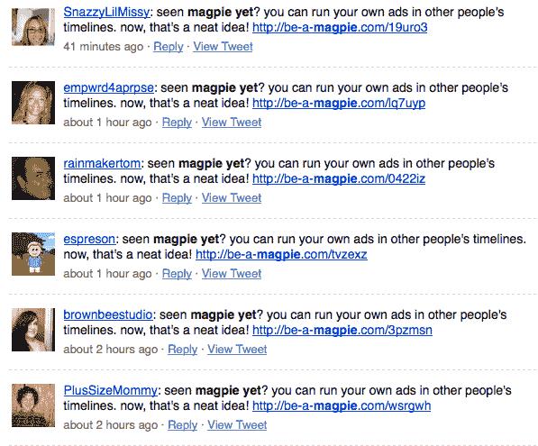

# 做喜鹊是 Twitter TechCrunch 的付费广告

> 原文：<https://web.archive.org/web/https://techcrunch.com/2008/11/23/be-a-magpie-is-payperpost-for-twitter/>

就像备受批评的博客网站 [PayPerPost](https://web.archive.org/web/20230213024812/http://www.crunchbase.com/company/payperpost) 一样，德国/英国初创公司 [Be-A-Mapgpie](https://web.archive.org/web/20230213024812/http://be-a-magpie.com/) 会付钱给你，让你在你的 Twitter 信息流中插入广告。

广告主按每千次印象付费，广告承诺根据关键词投放给相关受众。这意味着 Be-A-Magpie 会分析你的 Twitter 消息内容，看看是否有与特定广告客户相匹配的内容。

据报道，拥有 31000 名粉丝的 TechCrunch 推特账户每月可以赚到 14410.51€。

该服务会自动确定每条合法 Twitter 消息中插入的广告数量，默认情况下是每五条 Twitter 消息中插入一条广告。该服务通过存储你的 Twitter 凭证自动插入广告。至于披露——嗯，真的没有。每条推文都会添加一个#magpie 标签，但仅此而已。

尚不清楚 Twitter 是否会对此表示反对。他们的[条款和条件](https://web.archive.org/web/20230213024812/http://twitter.com/terms)没有明确排除它，但是一个修正可能是适当的。这里有一个关于是否应该禁止它的很好的讨论，由罗伯特·斯考伯发起。

不过，用户可能不会这么宽容。我想任何开始使用这个的人都会很快看到追随者的突然减少。

你可以知道谁已经注册了这项服务——该公司正在利用这些账户来传播自己的信息:

**更新:**感谢:本·凯斯勒似乎是第一个在 Be-A-Magpie 上给 PayPerPost 打电话的[。](https://web.archive.org/web/20230213024812/http://twitter.com/kessler/statuses/1015631749)