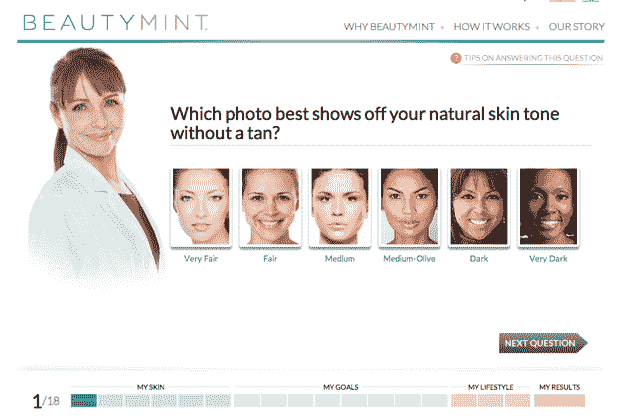

# BeachMint 的 BeautyMint 在头 24 小时内吸引了 50 万游客(感谢杰西卡·辛普森)

> 原文：<https://web.archive.org/web/http://techcrunch.com/2011/11/02/beachmints-new-vertical-beautymint-gets-500000-visitors-in-24-hours-thanks-to-jessica-simpson/>

2010 年 10 月，洛杉矶一家名为 [BeachMint](https://web.archive.org/web/20230208082613/http://www.beachmint.com/) 的初创公司推出了[jewel mint](https://web.archive.org/web/20230208082613/https://techcrunch.com/2010/10/04/beachmint-teams-with-kate-bosworth-to-launch-first-vertical-jewelmint/)——这项服务每月都会送你一件新珠宝，价格远低于你在百货公司购买类似物品的价格。他们遵循由 ShoeDazzle 流行的明星代言模式，与凯特·波茨沃斯和她的造型师切尔·库尔特合作选择珠宝——他们很快发现他们的手很受欢迎。

事实上，事情进展得如此顺利，以至于该公司在去年 6 月以 1.5 亿美元的传言估值筹集了[2350 万美元](https://web.archive.org/web/20230208082613/https://techcrunch.com/2011/06/17/beachmint-raises-23-5m-at-a-rumored-150m-valuation/)。接下来，他们在 7 月推出了第二部垂直电影[style mint](https://web.archive.org/web/20230208082613/http://www.stylemint.com/)——这次是由奥尔森姐妹组合支持的。现在他们准备好第三轮了。他们最新的垂直:护肤品。

周一，该公司推出了 BeautyMint，这是一项每月为你提供清洁用品、爽肤水、润肤霜和面霜的服务。然而，每个用户都收到了一个个性化的工具包，这取决于他们的皮肤类型、居住地点和一年中的时间等因素，而不是随机发送一些信息。到目前为止，该网站有一个非常好的开端，在最初的 24 小时内有超过 50 万的访问者。毫无疑问，第一天的巨大流量是因为杰西卡·辛普森是造币厂的代言人。

这是一件大事:辛普森是你熟悉 Proactiv 痤疮治疗的最大原因之一，她在 2005 年开始支持这种治疗。BeachMint 创始人约什·伯曼和迭戈·伯达金说，现在，她正把注意力转移到美容和老化产品上。这正是 BeautyMint 的专长。这项服务将收取每月 39.99 美元或 49.99 美元，这取决于你是否希望每次运输收到四件或五件物品。

他们还请来了奈瑞达·乔伊，一位为名人(包括辛普森)工作的美学家。Joy 将在很大程度上负责选择 BeautyMint 将向每个用户发送的产品——她帮助设计了一个测试，当用户首次注册该网站时，系统会提示他们进行测试(该测试会问他们一些问题，如他们是否担心皱纹或想要更紧致的皮肤)。随着时间的推移，用户将收到 Joy 基于他们之前收到的产品体验而提供的额外建议(换句话说，如果该服务推出了它认为会更好的产品，你的每月出货量可能会随着时间的推移而变化)。

BeautyMint 的所有产品都在其品牌下独家销售，该公司进行自己的产品开发(这些不仅仅是更名的产品)。伯达金说，由于产品开发过程，BeautyMint 比其以前的垂直市场花了更长的时间(总共九个月的计划)。

BeachMint 也即将推出更多垂直市场。本月晚些时候，该公司将推出 ShoeMint，每月向用户发送由蕾切尔·比尔森、蒋曦儿·查维斯和史蒂夫·马登设计的鞋子。创始人补充说，他们有更多的名人排队等候未来的垂直，他们还没有准备好宣布。

