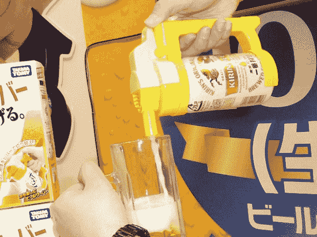
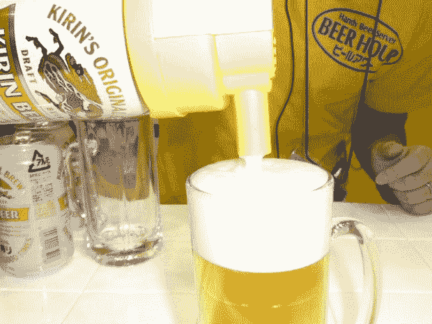
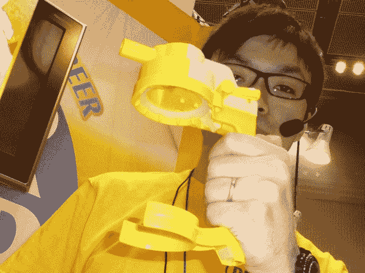

# 啤酒时间:Takara Tomy 的啤酒罐自动售货机 

> 原文：<https://web.archive.org/web/https://techcrunch.com/2011/01/26/beer-hour-takara-tomys-beer-can-dispenser/>

# 啤酒时间:Takara Tomy 的啤酒罐自动售货机

我不太确定啤酒爱好者*是否真的*需要这种小玩意，但 Takara Tomy 准备出售它(仅在日本——至少最初是这样)。该公司今天在东京展示了所谓的“啤酒时间”，这是一种小型设备，旨在使从易拉罐向玻璃杯中倒啤酒变得更容易。

根据 Takara Tomy 的说法，啤酒时间是为日本四大啤酒厂生产的罐装啤酒而“优化”的(我不知道这是什么意思)。但该公司也表示，基本上每一个容量在 350 毫升到 500 毫升之间的啤酒罐都可以装下，包括那些非日本制造的啤酒罐。

 

Takara Tomy 将于 5 月 19 日开始销售黄色和黑色的啤酒时间(价格:25 美元)。如果你住在日本以外的地方，请让专门的网上商店 [Rinkya](https://web.archive.org/web/20221207114237/http://www.rinkya.com/) 在设备上市时给你发货。

Via [IT 媒体](https://web.archive.org/web/20221207114237/http://plusd.itmedia.co.jp/lifestyle/articles/1101/25/news095.html) [JP]