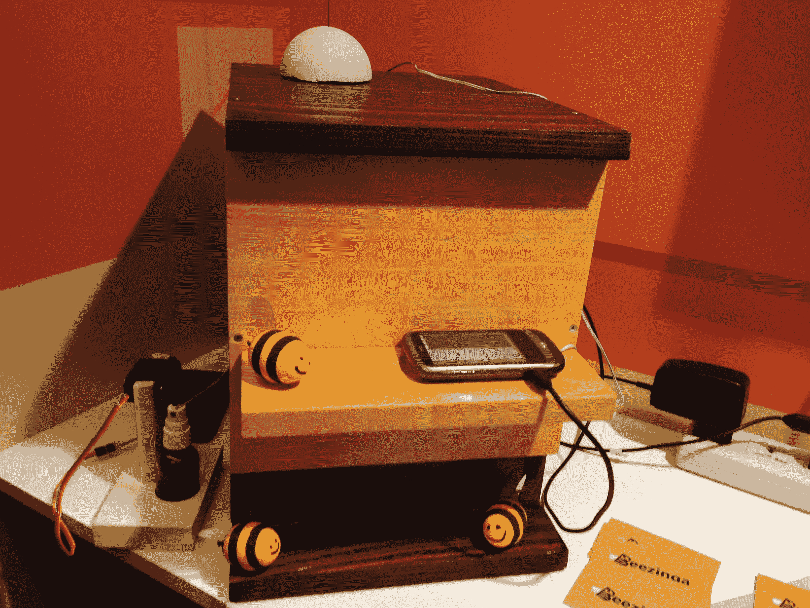

# Beezinga 将数据分析引入养蜂场

> 原文：<https://web.archive.org/web/https://techcrunch.com/2013/07/10/beezinga-brings-data-analytics-to-the-apiary/>

# Beezinga 将数据分析引入养蜂场

养蜂业并不是你在科技媒体上经常读到的东西，但它是一个很大的行业，仅在美国就有大约 2.689 亿美元的收入，技术正在慢慢地进入世界各地的养蜂场。 [Beezinga](https://web.archive.org/web/20230325002940/http://beezinga.com/) ，来自斯洛维尼亚的微软[想象杯](https://web.archive.org/web/20230325002940/http://www.imaginecup.com/) [决赛选手](https://web.archive.org/web/20230325002940/http://imaginecup.com/ic13/team/beezinga#?fbid=EKBhMW7qh6p)，开发了一套标准化蜂箱的传感器系统(是的，蜂箱也有[标准)。该系统可以测量蜂箱中的温度和湿度，以及蜂蜜产量(通过测量蜂箱的重量)和蜂箱的整体活动，方法是分析蜂箱入口处蜜蜂活动的视频。](https://web.archive.org/web/20230325002940/http://www.beekeepingforum.co.uk/showthread.php?t=856)

Beezinga 认为改造一个蜂箱大约需要 40 美元。该团队认为，这是商业养蜂人非常乐意支付的价格，以获得关于他们蜂巢的分析。Beezinga 目前正在对该系统进行 beta 测试，并计划在投入生产后采用订阅模式。

该系统定期从蜂箱更新数据到云端，养蜂人可以使用一个网络应用程序快速了解他们的蜜蜂在做什么。当然，该系统还可以在出现问题时发出实时警报。目前，Beezinga 使用一个带数据连接的标准手机从通常偏远的养蜂场发送数据(多个蜂箱可以与同一部手机通话)，但该团队也在研究如何使用现成的技术将无线技术直接集成到系统中，而不需要电话。

Beezinga 的一个很酷的方面是，它不仅可以进行分析，还可以保护蜂巢免受其他蜜蜂的攻击。使用音频分析，该系统识别出蜂巢何时受到攻击，并开始向蜂巢前面的攻击者喷水。在很大程度上，这足以击退这类攻击。

鉴于围绕[蜂群衰竭失调](https://web.archive.org/web/20230325002940/https://en.wikipedia.org/wiki/Colony_collapse_disorder)的讨论，Beezinga 还认为，它可以创建一个关于养蜂的大型信息数据库，这可能有助于研究人员了解世界各地蜜蜂种群到底发生了什么。

Beezinga 目前正在圣彼得堡参加想象杯决赛。在过去两天向一组评委展示了他们的项目后，决赛选手现在必须等到明天才能知道他们是否赢得了微软年度学生技术竞赛的奖项。