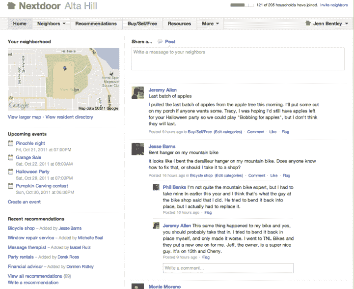

# 基准支持的 Nextdoor 作为面向社区的私人社交网络发布 TechCrunch

> 原文：<https://web.archive.org/web/https://techcrunch.com/2011/10/26/benchmark-backed-nextdoor-launches-as-a-private-social-network-for-neighborhoods/>

已经有很多初创公司尝试为邻里和社区创建社交网络，包括 [OhSoWe](https://web.archive.org/web/20221205124452/https://beta.techcrunch.com/2011/05/13/opentable-founder-launches-ohsowe-a-network-for-neighborhoods/) 和 [DeHood。](https://web.archive.org/web/20221205124452/https://beta.techcrunch.com/2010/05/26/dehood-launches-a-foursquare-meets-twitter-meets-yelp-meets-ning-for-iphone/)但是还没有一个平台能够成为当地社区团体的首选社交平台。进入基准支持的 [Nextdoor，](https://web.archive.org/web/20221205124452/https://nextdoor.com/)下一个在社区网络中脱颖而出的创业公司。

Nextdoor 是一个面向社区的私人社交网络，由 Epinions 的 Nirav Tolia 共同创建。在 Epinions(后来成为 Shopping.com)之后，Tolia 在 Benchmark 做了一段时间的 EIR，然后[共同创立了 FanBase](https://web.archive.org/web/20221205124452/https://beta.techcrunch.com/2009/08/24/fanbase-launches-wikipedia-style-directory-of-all-things-sports/) ，这是一个关于所有运动的目录。

现在 Tolia 正在进行他的下一个项目，Nextdoor，在过去一年的私下测试后，今天向公众推出。在 Nextdoor 上，邻居为他们的邻居创建了类似脸书的私人网站，在那里他们可以问问题，互相了解，交流当地的意见和建议。讨论的话题多种多样，包括当地事件、学校筹款、水管工和保姆推荐、最近的犯罪活动、即将到来的车库拍卖，甚至是丢失的宠物。与电子邮件列表服务器或其他在线群组不同，邻居的帖子会被组织和存档以供将来参考。

所有的社区都是私有的，你可以通过输入你的地址来验证你是否住在一个特定的社区。其实网络有一个严谨的流程，人们可以在其中加入。Nextdoor 使用四种方法来验证成员地址。Nextdoor 可以向新会员的地址发送一张明信片，上面印有一个独特的代码。该代码将允许他们登录并验证他们的帐户。如果您的家庭住址登记了一个列出的电话号码，您可以绕过这一步，并且可以请求一个免费电话来验证您的家庭住址。Nextdoor 还可以通过信用卡账单地址即时验证新会员的家庭住址
。或者已经是网站认证会员的人可以通过电子邮件、传单或明信片邀请邻居访问他们的网站来为他们担保。

Nextdoor 上共享的信息受密码保护，邻居以外的人无法访问，也无法在谷歌和其他搜索引擎上找到。通过每个社区的地图，您可以看到哪些邻居已经加入，哪些尚未加入。用户可以在居民目录中查找其他邻居，查看邻居地图，寻求建议，交换本地推荐，以及相互共享邻居信息。邻居可以选择通过电子邮件或仅在网站上查看和回复更新。

托利亚认为，为了更大的利益，尝试解决邻里和社区之间的联系是一个巨大的机会。他解释说，大多数交流是通过电子邮件或电话进行的，每个当地社区都需要一个私人的交流平台。

Benchmark 合伙人 Bill Gurley 对此表示赞同。“Nextdoor 不同于其他社交网站，因为它是从头开始建立的，旨在帮助邻居在一个可信的环境中走到一起……我们被对 Nextdoor 的积极回应所震惊，并相信这是社交网络的自然发展，将向各地的邻居展示建立社区的价值。”

Nextdoor 从 Benchmark Capital 和 Shasta Ventures 获得了一笔未披露金额的资金。Gurley 和 Shasta Venture 的 Jason Pressman 与 Zillow 的联合创始人兼董事长 Rich Barton 一起担任董事会成员。

艾德·埃弗雷特(Ed Everett)是 Nextdoor 的高级城市策略师，也是红杉市的前城市经理，已经在城市管理部门工作多年。他说，在社区层面，没有吸引人的提议来为社区创建一个在线社区。他认为，由于 Nextdoor 的私有性和地理集中性，该网络是社区的理想平台。

在过去的一年里，26 个州超过 175 个社区的邻居建立了 Nextdoor 网站，目标是创造更多互联和更安全的家。Tolia 表示，用户的参与度很高，该平台得到了会员的积极响应。

下面是我们与 Tolia 的视频:

[YouTube http://www.youtube.com/watch?v=5nd3Y_ZyieQ]