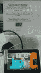

# 百思买将 7 英寸 HTC Flyer Android 平板电脑降价至 99 美元更新 

> 原文：<https://web.archive.org/web/http://techcrunch.com/2011/10/06/best-buy-slashes-the-7-inch-htc-flyer-android-tablet-down-to-99/>

# 百思买将 7 英寸 HTC Flyer Android 平板电脑降价至 99 美元更新

我的天啊。平板电脑价格直线下降。HTC 传单目前在百思买仅售 99 美元。目前价格似乎与百思买无关，因此价格下降很可能不是来自 HTC，而是来自百思买。网站已经卖完了，但是你当地的商店可能还有一些。你知道该怎么做:放下一切，去你的百思买。这是一笔了不起的交易，希望是制造商和零售商终于变得积极的标志。

惠普通过将[触摸板](https://web.archive.org/web/20230203070953/http://techcrunch.com/tag/touchpad/)降至 99 美元，开启了大甩卖的潮流。即使是死操作系统，TouchPad 也是一笔 99 美元的惊人交易。惠普和零售商在数小时内售罄。HTC Flyer 可能是一个稍微小一点的标签，但它震撼了一个成熟的 Android 版本，并且构建得非常好。只卖 99 美元，真便宜。

RIM 公司最近还在 T4 将其平板电脑 PlayBook 的价格下调至 300 美元。但还是定价过高。亚马逊用 200 美元的 Kindle Fire 做对了。消费者需要一个足够低的价格，让购买感觉像一笔交易。在定价合适之前，非 iPad 平板电脑将会停滞不前。期望 99 美元的主流平板电脑是不现实的，但价格仍然需要下降到更具竞争力的水平。

正如 liliputing 指出的那样，百思买传单销售可能是一个意外，但也是一笔值得追求的交易。放下一切，去你当地的百思买商场，告诉蓝衬衫店主尽快把你的传单送来。

 感谢斯蒂芬的照片！