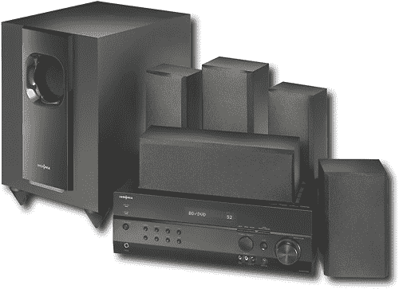

# 百思买 Insignia 品牌提供 Audyssey 

> 原文：<https://web.archive.org/web/https://techcrunch.com/2010/06/23/best-buys-insignia-brand-to-offer-audyssey/>

# 百思买的 Insignia 品牌将提供给 Audyssey

百思买的廉价品牌， [Insignia](https://web.archive.org/web/20221202042916/http://www.crunchgear.com/tag/insignia/) ，正在提供一个新的 5.1 家庭影院系统，采用奥黛西技术，是的，奥黛西。我们爱奥黛西。

> “消费者告诉我们，他们想要最新的家庭影院音频技术，易于安装，易于控制，价格合理，”百思买独家品牌副总裁费尔南多·席尔瓦说。“我们的 Insignia 家庭影院系统是一个完整的家庭音频解决方案，提供丰富的环绕声，将任何家庭房间都变成影院般的体验。”

**特色**

*   5.1 环绕，每通道 110 瓦
*   5 个扬声器
*   120 瓦低音炮
*   3 个 HDMI 1.4 输入，1 个 HDMI 输出(支持新的蓝光音频和 3D 视频格式)
*   预编程通用遥控器

最后，奥黛西。

> Audyssey audio 技术，它将自动增强电影或电视节目中较安静的部分，同时消除喧闹的商业广告的声音，以获得更愉快的听觉体验。该系统还包括扬声器设置麦克风和 Audyssey 自动设置，便于家庭安装。